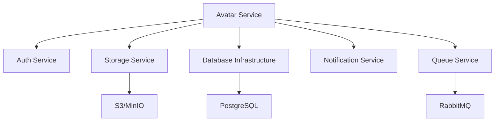

# Architecture Specification: Avatar Service (spec-feature-01)

## Document Overview

**Version**: 1.0
**Last Updated**: November 2025
**Status**: Draft
**Service**: Avatar Service
**Dependencies**: Storage Infrastructure, Database Infrastructure, Authentication

---

## 1. System Overview

### 1.1 Purpose
The Avatar Service provides comprehensive user avatar creation, management, and manipulation capabilities. It processes user photos to extract body measurements, generates accurate 3D representations, and manages avatar lifecycle.

### 1.2 Key Capabilities
- Photo-based avatar generation with AI-powered measurement extraction
- Manual measurement-based avatar creation
- Preset template-based avatar generation
- Avatar storage, versioning, and retrieval
- Avatar visualization and modification
- Body analysis and recommendations
- Privacy-focused data handling

### 1.3 Service Boundaries
- **In Scope**: Avatar CRUD operations, photo processing, measurement extraction, 3D model generation, avatar analysis
- **Out of Scope**: Garment design, catalog management, rendering engine (provided by frontend)
- **Integration Points**: Storage service, authentication service, notification service

---

## 2. Architecture Components

### 2.1 High-Level Architecture

```
┌─────────────────────────────────────────────────────────────────┐
│                        Avatar Service                            │
├─────────────────────────────────────────────────────────────────┤
│                                                                   │
│  ┌──────────────────┐  ┌──────────────────┐  ┌───────────────┐│
│  │   API Gateway    │  │  WebSocket       │  │   Admin API   ││
│  │   (REST/GraphQL) │  │  Server          │  │               ││
│  └────────┬─────────┘  └────────┬─────────┘  └───────┬───────┘│
│           │                     │                     │         │
│  ┌────────┴─────────────────────┴─────────────────────┴──────┐ │
│  │              Application Layer (Controllers)               │ │
│  └────────┬───────────────────────────────────────────────────┘ │
│           │                                                       │
│  ┌────────┴───────────────────────────────────────────────────┐ │
│  │                  Business Logic Layer                       │ │
│  │  ┌──────────────┐  ┌──────────────┐  ┌──────────────┐    │ │
│  │  │   Avatar     │  │   Photo      │  │  Measurement │    │ │
│  │  │   Manager    │  │   Processor  │  │   Extractor  │    │ │
│  │  └──────────────┘  └──────────────┘  └──────────────┘    │ │
│  │  ┌──────────────┐  ┌──────────────┐  ┌──────────────┐    │ │
│  │  │  3D Model    │  │   Body       │  │   Privacy    │    │ │
│  │  │  Generator   │  │   Analyzer   │  │   Manager    │    │ │
│  │  └──────────────┘  └──────────────┘  └──────────────┘    │ │
│  └────────┬───────────────────────────────────────────────────┘ │
│           │                                                       │
│  ┌────────┴───────────────────────────────────────────────────┐ │
│  │                    Data Access Layer                        │ │
│  │  ┌──────────────┐  ┌──────────────┐  ┌──────────────┐    │ │
│  │  │  Avatar      │  │  Measurement │  │   Photo      │    │ │
│  │  │  Repository  │  │  Repository  │  │   Repository │    │ │
│  │  └──────────────┘  └──────────────┘  └──────────────┘    │ │
│  └────────────────────────────────────────────────────────────┘ │
│                                                                   │
└───────────────────────────┬───────────────────────────────────────┘
                            │
        ┌───────────────────┼───────────────────┐
        │                   │                   │
┌───────▼────────┐ ┌────────▼────────┐ ┌───────▼────────┐
│   PostgreSQL   │ │   S3/Storage    │ │  Redis Cache   │
│   Database     │ │   (Photos/3D)   │ │                │
└────────────────┘ └─────────────────┘ └────────────────┘
        │                   │                   │
┌───────▼───────────────────▼───────────────────▼────────┐
│          Message Queue (RabbitMQ/SQS)                   │
│  - Photo Processing Queue                               │
│  - 3D Generation Queue                                  │
│  - Measurement Extraction Queue                         │
└─────────────────────────────────────────────────────────┘
```

### 2.2 Core Components

#### 2.2.1 Avatar Manager
- **Responsibility**: Avatar lifecycle management, CRUD operations
- **Key Functions**:
  - Create, read, update, delete avatars
  - Avatar versioning and history
  - Avatar comparison logic
  - Avatar sharing and permissions
  - Multi-avatar management per user

#### 2.2.2 Photo Processor
- **Responsibility**: Photo upload, validation, and preprocessing
- **Key Functions**:
  - Photo upload handling (multipart/form-data)
  - Format validation (JPEG, PNG, WebP)
  - Size and resolution validation
  - EXIF data extraction and sanitization
  - Background removal
  - Image preprocessing for AI models
  - Temporary storage management

#### 2.2.3 Measurement Extractor
- **Responsibility**: AI-powered body measurement extraction from photos
- **Key Functions**:
  - Pose detection using computer vision models
  - Body landmark identification
  - Measurement calculation algorithms
  - Confidence scoring
  - Measurement validation
  - Statistical interpolation for missing measurements
  - Manual measurement override handling

#### 2.2.4 3D Model Generator
- **Responsibility**: Generate 3D avatar models from measurements
- **Key Functions**:
  - Parametric 3D mesh generation
  - Body proportion calculations
  - Skin tone application
  - LOD (Level of Detail) generation
  - Model optimization and compression
  - Multiple format export (GLTF, FBX, OBJ)
  - UV mapping for texture application

#### 2.2.5 Body Analyzer
- **Responsibility**: Body analysis and recommendations
- **Key Functions**:
  - Body type classification
  - Proportion analysis
  - Symmetry detection
  - Fit preference learning
  - Size recommendation generation
  - Body shape categorization

#### 2.2.6 Privacy Manager
- **Responsibility**: Privacy controls and data protection
- **Key Functions**:
  - Photo auto-deletion after processing
  - Anonymization options
  - Consent management
  - Data encryption coordination
  - GDPR compliance enforcement
  - Selective data sharing controls

### 2.3 Background Workers

#### 2.3.1 Photo Processing Worker
- Asynchronous photo processing
- Background removal
- Quality enhancement
- Multiple photo alignment

#### 2.3.2 Measurement Extraction Worker
- AI model inference
- Batch measurement processing
- Confidence scoring computation
- Validation and anomaly detection

#### 2.3.3 3D Generation Worker
- Asynchronous 3D model generation
- LOD generation
- Model optimization
- Export format generation

---

## 3. Data Models

### 3.1 Core Entities

#### 3.1.1 Avatar
```typescript
interface Avatar {
  id: UUID;
  userId: UUID;
  name: string;
  description?: string;
  avatarType: 'photo_based' | 'measurement_based' | 'preset_based';
  status: 'draft' | 'processing' | 'completed' | 'failed';

  // Metadata
  createdAt: DateTime;
  updatedAt: DateTime;
  version: number;
  parentAvatarId?: UUID; // For versioning

  // Privacy settings
  visibility: 'private' | 'shared' | 'public';
  allowExport: boolean;
  allowAITraining: boolean;

  // References
  measurementProfileId: UUID;
  bodyAnalysisId?: UUID;
  modelFileId: UUID;

  // Tags and categorization
  tags: string[];
  bodyType?: BodyType;

  // Processing metadata
  processingStartedAt?: DateTime;
  processingCompletedAt?: DateTime;
  processingError?: string;
}
```

#### 3.1.2 MeasurementProfile
```typescript
interface MeasurementProfile {
  id: UUID;
  avatarId: UUID;

  // Basic measurements (cm)
  height: number;
  weight?: number;
  chest: number;
  waist: number;
  hips: number;

  // Detailed measurements (cm)
  shoulderWidth: number;
  armLength: number;
  inseam: number;
  neckCircumference: number;

  // Advanced measurements (cm, optional)
  bicep?: number;
  forearm?: number;
  thigh?: number;
  calf?: number;
  wrist?: number;
  ankle?: number;

  // Measurement metadata
  unit: 'metric' | 'imperial';
  extractionMethod: 'ai' | 'manual' | 'preset' | 'mixed';
  confidenceScores: Record<string, number>; // Per measurement

  // Manual overrides
  manualOverrides: string[]; // List of manually adjusted measurements

  createdAt: DateTime;
  updatedAt: DateTime;
}
```

#### 3.1.3 PhotoUpload
```typescript
interface PhotoUpload {
  id: UUID;
  avatarId: UUID;
  userId: UUID;

  // Photo metadata
  viewType: 'front' | 'side' | 'back' | 'other';
  originalFilename: string;
  fileSize: number;
  mimeType: string;
  width: number;
  height: number;

  // Storage
  storageKey: string;
  storageBucket: string;
  thumbnailKey?: string;
  processedKey?: string; // After background removal

  // EXIF data (sanitized)
  captureDate?: DateTime;
  deviceInfo?: string;

  // Processing status
  status: 'uploaded' | 'processing' | 'processed' | 'failed' | 'deleted';
  processingError?: string;

  // Privacy
  autoDeleteAt: DateTime; // Default: 24 hours after processing
  deleted: boolean;
  deletedAt?: DateTime;

  createdAt: DateTime;
  updatedAt: DateTime;
}
```

#### 3.1.4 ModelFile
```typescript
interface ModelFile {
  id: UUID;
  avatarId: UUID;

  // Model metadata
  format: 'gltf' | 'glb' | 'fbx' | 'obj';
  lodLevel: 'high' | 'medium' | 'low' | 'mobile';
  fileSize: number;

  // Storage
  storageKey: string;
  storageBucket: string;

  // Model properties
  vertexCount: number;
  faceCount: number;
  textureCount: number;

  // Generation metadata
  generationMethod: 'parametric' | 'scan_based' | 'preset';
  generationParameters: Record<string, any>;

  createdAt: DateTime;
}
```

#### 3.1.5 BodyAnalysis
```typescript
interface BodyAnalysis {
  id: UUID;
  avatarId: UUID;
  measurementProfileId: UUID;

  // Classifications
  bodyType: 'apple' | 'pear' | 'rectangle' | 'hourglass' | 'inverted_triangle';
  bodyTypeConfidence: number;

  // Proportions
  shoulderToHipRatio: number;
  waistToHipRatio: number;
  waistToHeightRatio: number;

  // Analysis results
  proportionAnalysis: {
    balanced: boolean;
    recommendations: string[];
  };

  // Symmetry
  symmetryScore: number; // 0-1
  symmetryIssues?: string[];

  // Fit preferences (learned over time)
  fitPreferences: {
    tops: 'fitted' | 'regular' | 'loose' | 'oversized';
    bottoms: 'fitted' | 'regular' | 'loose' | 'oversized';
  };

  // Size recommendations
  sizeRecommendations: Record<string, string>; // brand -> size

  createdAt: DateTime;
  updatedAt: DateTime;
}
```

#### 3.1.6 AvatarVersion
```typescript
interface AvatarVersion {
  id: UUID;
  avatarId: UUID;
  version: number;

  // Snapshot of avatar state
  measurementProfileSnapshot: MeasurementProfile;
  modelFileId: UUID;
  bodyAnalysisSnapshot?: BodyAnalysis;

  // Change metadata
  changeDescription?: string;
  changedBy: UUID;
  changeType: 'measurement_update' | 'regeneration' | 'customization' | 'initial';

  createdAt: DateTime;
}
```

### 3.2 Database Schema

```sql
-- Avatars table
CREATE TABLE avatars (
  id UUID PRIMARY KEY DEFAULT gen_random_uuid(),
  user_id UUID NOT NULL REFERENCES users(id) ON DELETE CASCADE,
  name VARCHAR(255) NOT NULL,
  description TEXT,
  avatar_type VARCHAR(50) NOT NULL CHECK (avatar_type IN ('photo_based', 'measurement_based', 'preset_based')),
  status VARCHAR(50) NOT NULL DEFAULT 'draft' CHECK (status IN ('draft', 'processing', 'completed', 'failed')),

  -- Metadata
  created_at TIMESTAMP WITH TIME ZONE DEFAULT CURRENT_TIMESTAMP,
  updated_at TIMESTAMP WITH TIME ZONE DEFAULT CURRENT_TIMESTAMP,
  version INTEGER DEFAULT 1,
  parent_avatar_id UUID REFERENCES avatars(id) ON DELETE SET NULL,

  -- Privacy
  visibility VARCHAR(50) DEFAULT 'private' CHECK (visibility IN ('private', 'shared', 'public')),
  allow_export BOOLEAN DEFAULT true,
  allow_ai_training BOOLEAN DEFAULT false,

  -- References
  measurement_profile_id UUID REFERENCES measurement_profiles(id) ON DELETE SET NULL,
  body_analysis_id UUID REFERENCES body_analyses(id) ON DELETE SET NULL,
  model_file_id UUID REFERENCES model_files(id) ON DELETE SET NULL,

  -- Tags
  tags TEXT[] DEFAULT '{}',
  body_type VARCHAR(50),

  -- Processing
  processing_started_at TIMESTAMP WITH TIME ZONE,
  processing_completed_at TIMESTAMP WITH TIME ZONE,
  processing_error TEXT,

  -- Indexes
  CONSTRAINT unique_user_avatar_name UNIQUE(user_id, name)
);

CREATE INDEX idx_avatars_user_id ON avatars(user_id);
CREATE INDEX idx_avatars_status ON avatars(status);
CREATE INDEX idx_avatars_created_at ON avatars(created_at DESC);
CREATE INDEX idx_avatars_tags ON avatars USING GIN(tags);

-- Measurement profiles table
CREATE TABLE measurement_profiles (
  id UUID PRIMARY KEY DEFAULT gen_random_uuid(),
  avatar_id UUID NOT NULL REFERENCES avatars(id) ON DELETE CASCADE,

  -- Basic measurements (stored in cm)
  height DECIMAL(6,2) NOT NULL,
  weight DECIMAL(6,2),
  chest DECIMAL(6,2) NOT NULL,
  waist DECIMAL(6,2) NOT NULL,
  hips DECIMAL(6,2) NOT NULL,

  -- Detailed measurements
  shoulder_width DECIMAL(6,2) NOT NULL,
  arm_length DECIMAL(6,2) NOT NULL,
  inseam DECIMAL(6,2) NOT NULL,
  neck_circumference DECIMAL(6,2) NOT NULL,

  -- Advanced measurements
  bicep DECIMAL(6,2),
  forearm DECIMAL(6,2),
  thigh DECIMAL(6,2),
  calf DECIMAL(6,2),
  wrist DECIMAL(6,2),
  ankle DECIMAL(6,2),

  -- Metadata
  unit VARCHAR(20) DEFAULT 'metric' CHECK (unit IN ('metric', 'imperial')),
  extraction_method VARCHAR(50) NOT NULL CHECK (extraction_method IN ('ai', 'manual', 'preset', 'mixed')),
  confidence_scores JSONB DEFAULT '{}',
  manual_overrides TEXT[] DEFAULT '{}',

  created_at TIMESTAMP WITH TIME ZONE DEFAULT CURRENT_TIMESTAMP,
  updated_at TIMESTAMP WITH TIME ZONE DEFAULT CURRENT_TIMESTAMP,

  CONSTRAINT unique_avatar_measurement_profile UNIQUE(avatar_id)
);

CREATE INDEX idx_measurement_profiles_avatar_id ON measurement_profiles(avatar_id);

-- Photo uploads table
CREATE TABLE photo_uploads (
  id UUID PRIMARY KEY DEFAULT gen_random_uuid(),
  avatar_id UUID NOT NULL REFERENCES avatars(id) ON DELETE CASCADE,
  user_id UUID NOT NULL REFERENCES users(id) ON DELETE CASCADE,

  -- Photo metadata
  view_type VARCHAR(50) NOT NULL CHECK (view_type IN ('front', 'side', 'back', 'other')),
  original_filename VARCHAR(500),
  file_size INTEGER NOT NULL,
  mime_type VARCHAR(100) NOT NULL,
  width INTEGER NOT NULL,
  height INTEGER NOT NULL,

  -- Storage
  storage_key VARCHAR(500) NOT NULL,
  storage_bucket VARCHAR(200) NOT NULL,
  thumbnail_key VARCHAR(500),
  processed_key VARCHAR(500),

  -- EXIF data
  capture_date TIMESTAMP WITH TIME ZONE,
  device_info TEXT,

  -- Processing
  status VARCHAR(50) DEFAULT 'uploaded' CHECK (status IN ('uploaded', 'processing', 'processed', 'failed', 'deleted')),
  processing_error TEXT,

  -- Privacy
  auto_delete_at TIMESTAMP WITH TIME ZONE NOT NULL,
  deleted BOOLEAN DEFAULT false,
  deleted_at TIMESTAMP WITH TIME ZONE,

  created_at TIMESTAMP WITH TIME ZONE DEFAULT CURRENT_TIMESTAMP,
  updated_at TIMESTAMP WITH TIME ZONE DEFAULT CURRENT_TIMESTAMP
);

CREATE INDEX idx_photo_uploads_avatar_id ON photo_uploads(avatar_id);
CREATE INDEX idx_photo_uploads_user_id ON photo_uploads(user_id);
CREATE INDEX idx_photo_uploads_status ON photo_uploads(status);
CREATE INDEX idx_photo_uploads_auto_delete ON photo_uploads(auto_delete_at) WHERE deleted = false;

-- Model files table
CREATE TABLE model_files (
  id UUID PRIMARY KEY DEFAULT gen_random_uuid(),
  avatar_id UUID NOT NULL REFERENCES avatars(id) ON DELETE CASCADE,

  -- Model metadata
  format VARCHAR(50) NOT NULL CHECK (format IN ('gltf', 'glb', 'fbx', 'obj')),
  lod_level VARCHAR(50) NOT NULL CHECK (lod_level IN ('high', 'medium', 'low', 'mobile')),
  file_size INTEGER NOT NULL,

  -- Storage
  storage_key VARCHAR(500) NOT NULL,
  storage_bucket VARCHAR(200) NOT NULL,

  -- Model properties
  vertex_count INTEGER,
  face_count INTEGER,
  texture_count INTEGER,

  -- Generation metadata
  generation_method VARCHAR(50) NOT NULL,
  generation_parameters JSONB DEFAULT '{}',

  created_at TIMESTAMP WITH TIME ZONE DEFAULT CURRENT_TIMESTAMP
);

CREATE INDEX idx_model_files_avatar_id ON model_files(avatar_id);
CREATE INDEX idx_model_files_lod_level ON model_files(lod_level);

-- Body analyses table
CREATE TABLE body_analyses (
  id UUID PRIMARY KEY DEFAULT gen_random_uuid(),
  avatar_id UUID NOT NULL REFERENCES avatars(id) ON DELETE CASCADE,
  measurement_profile_id UUID NOT NULL REFERENCES measurement_profiles(id) ON DELETE CASCADE,

  -- Classifications
  body_type VARCHAR(50) NOT NULL,
  body_type_confidence DECIMAL(4,3) NOT NULL,

  -- Proportions
  shoulder_to_hip_ratio DECIMAL(5,3),
  waist_to_hip_ratio DECIMAL(5,3),
  waist_to_height_ratio DECIMAL(5,3),

  -- Analysis
  proportion_analysis JSONB DEFAULT '{}',
  symmetry_score DECIMAL(4,3),
  symmetry_issues TEXT[],

  -- Preferences
  fit_preferences JSONB DEFAULT '{}',
  size_recommendations JSONB DEFAULT '{}',

  created_at TIMESTAMP WITH TIME ZONE DEFAULT CURRENT_TIMESTAMP,
  updated_at TIMESTAMP WITH TIME ZONE DEFAULT CURRENT_TIMESTAMP,

  CONSTRAINT unique_avatar_body_analysis UNIQUE(avatar_id)
);

CREATE INDEX idx_body_analyses_avatar_id ON body_analyses(avatar_id);
CREATE INDEX idx_body_analyses_body_type ON body_analyses(body_type);

-- Avatar versions table
CREATE TABLE avatar_versions (
  id UUID PRIMARY KEY DEFAULT gen_random_uuid(),
  avatar_id UUID NOT NULL REFERENCES avatars(id) ON DELETE CASCADE,
  version INTEGER NOT NULL,

  -- Snapshots
  measurement_profile_snapshot JSONB NOT NULL,
  model_file_id UUID REFERENCES model_files(id) ON DELETE SET NULL,
  body_analysis_snapshot JSONB,

  -- Change metadata
  change_description TEXT,
  changed_by UUID NOT NULL REFERENCES users(id) ON DELETE SET NULL,
  change_type VARCHAR(50) NOT NULL,

  created_at TIMESTAMP WITH TIME ZONE DEFAULT CURRENT_TIMESTAMP,

  CONSTRAINT unique_avatar_version UNIQUE(avatar_id, version)
);

CREATE INDEX idx_avatar_versions_avatar_id ON avatar_versions(avatar_id);
CREATE INDEX idx_avatar_versions_created_at ON avatar_versions(created_at DESC);
```

---

## 4. API Design

### 4.1 RESTful API Endpoints

#### 4.1.1 Avatar Management

```
POST   /api/v1/avatars
GET    /api/v1/avatars
GET    /api/v1/avatars/:id
PUT    /api/v1/avatars/:id
DELETE /api/v1/avatars/:id
GET    /api/v1/avatars/:id/versions
POST   /api/v1/avatars/:id/duplicate
POST   /api/v1/avatars/:id/compare
GET    /api/v1/avatars/:id/export
```

#### 4.1.2 Photo Management

```
POST   /api/v1/avatars/:id/photos
GET    /api/v1/avatars/:id/photos
DELETE /api/v1/avatars/:id/photos/:photoId
POST   /api/v1/avatars/:id/photos/process
```

#### 4.1.3 Measurements

```
GET    /api/v1/avatars/:id/measurements
PUT    /api/v1/avatars/:id/measurements
POST   /api/v1/avatars/:id/measurements/extract
POST   /api/v1/avatars/:id/measurements/validate
```

#### 4.1.4 Body Analysis

```
GET    /api/v1/avatars/:id/analysis
POST   /api/v1/avatars/:id/analysis/regenerate
GET    /api/v1/avatars/:id/size-recommendations
```

#### 4.1.5 3D Models

```
GET    /api/v1/avatars/:id/models
POST   /api/v1/avatars/:id/models/generate
GET    /api/v1/avatars/:id/models/:modelId
GET    /api/v1/avatars/:id/models/:modelId/download
```

### 4.2 API Specifications

#### 4.2.1 Create Avatar (Photo-based)

```http
POST /api/v1/avatars
Content-Type: multipart/form-data
Authorization: Bearer <token>

{
  "name": "My Avatar",
  "avatarType": "photo_based",
  "photos": [
    { "file": <binary>, "viewType": "front" },
    { "file": <binary>, "viewType": "side" }
  ],
  "preferences": {
    "autoProcess": true,
    "visibility": "private",
    "allowExport": true
  }
}

Response: 201 Created
{
  "id": "uuid",
  "name": "My Avatar",
  "status": "processing",
  "avatarType": "photo_based",
  "createdAt": "2025-11-17T10:00:00Z",
  "processingEstimate": "60 seconds"
}
```

#### 4.2.2 Create Avatar (Measurement-based)

```http
POST /api/v1/avatars
Content-Type: application/json
Authorization: Bearer <token>

{
  "name": "My Avatar",
  "avatarType": "measurement_based",
  "measurements": {
    "height": 175,
    "weight": 70,
    "chest": 95,
    "waist": 80,
    "hips": 100,
    "shoulderWidth": 45,
    "armLength": 60,
    "inseam": 78,
    "neckCircumference": 38,
    "unit": "metric"
  },
  "preferences": {
    "visibility": "private",
    "allowExport": true
  }
}

Response: 201 Created
{
  "id": "uuid",
  "name": "My Avatar",
  "status": "processing",
  "avatarType": "measurement_based",
  "createdAt": "2025-11-17T10:00:00Z"
}
```

#### 4.2.3 Get Avatar Details

```http
GET /api/v1/avatars/:id
Authorization: Bearer <token>

Response: 200 OK
{
  "id": "uuid",
  "userId": "uuid",
  "name": "My Avatar",
  "description": "Summer body measurements",
  "avatarType": "photo_based",
  "status": "completed",
  "createdAt": "2025-11-17T10:00:00Z",
  "updatedAt": "2025-11-17T10:02:00Z",
  "version": 1,
  "visibility": "private",
  "measurements": {
    "height": 175,
    "weight": 70,
    "chest": 95,
    "waist": 80,
    "hips": 100,
    "unit": "metric",
    "confidenceScores": {
      "height": 0.95,
      "chest": 0.88,
      "waist": 0.92
    }
  },
  "bodyAnalysis": {
    "bodyType": "hourglass",
    "confidence": 0.87,
    "proportions": {
      "shoulderToHipRatio": 0.95,
      "waistToHipRatio": 0.80
    }
  },
  "models": [
    {
      "id": "uuid",
      "format": "gltf",
      "lodLevel": "high",
      "fileSize": 4567890,
      "downloadUrl": "/api/v1/avatars/:id/models/:modelId/download"
    }
  ],
  "tags": ["summer", "2025"]
}
```

#### 4.2.4 Update Measurements

```http
PUT /api/v1/avatars/:id/measurements
Content-Type: application/json
Authorization: Bearer <token>

{
  "measurements": {
    "waist": 78,
    "hips": 98
  },
  "regenerateModel": true
}

Response: 200 OK
{
  "id": "uuid",
  "status": "processing",
  "message": "Measurements updated. 3D model regeneration in progress.",
  "version": 2
}
```

### 4.3 GraphQL Schema

```graphql
type Avatar {
  id: ID!
  userId: ID!
  name: String!
  description: String
  avatarType: AvatarType!
  status: AvatarStatus!
  createdAt: DateTime!
  updatedAt: DateTime!
  version: Int!
  parentAvatar: Avatar
  visibility: Visibility!
  allowExport: Boolean!
  measurements: MeasurementProfile!
  bodyAnalysis: BodyAnalysis
  models: [ModelFile!]!
  photos: [PhotoUpload!]!
  versions: [AvatarVersion!]!
  tags: [String!]!
}

enum AvatarType {
  PHOTO_BASED
  MEASUREMENT_BASED
  PRESET_BASED
}

enum AvatarStatus {
  DRAFT
  PROCESSING
  COMPLETED
  FAILED
}

enum Visibility {
  PRIVATE
  SHARED
  PUBLIC
}

type MeasurementProfile {
  id: ID!
  height: Float!
  weight: Float
  chest: Float!
  waist: Float!
  hips: Float!
  shoulderWidth: Float!
  armLength: Float!
  inseam: Float!
  neckCircumference: Float!
  unit: MeasurementUnit!
  extractionMethod: ExtractionMethod!
  confidenceScores: JSON!
  manualOverrides: [String!]!
}

type BodyAnalysis {
  id: ID!
  bodyType: BodyType!
  bodyTypeConfidence: Float!
  shoulderToHipRatio: Float
  waistToHipRatio: Float
  waistToHeightRatio: Float
  proportionAnalysis: JSON!
  symmetryScore: Float
  fitPreferences: JSON!
  sizeRecommendations: JSON!
}

type ModelFile {
  id: ID!
  format: ModelFormat!
  lodLevel: LODLevel!
  fileSize: Int!
  vertexCount: Int
  faceCount: Int
  downloadUrl: String!
  createdAt: DateTime!
}

# Queries
type Query {
  avatar(id: ID!): Avatar
  avatars(filter: AvatarFilter, pagination: Pagination): AvatarConnection!
  avatarVersions(avatarId: ID!): [AvatarVersion!]!
}

# Mutations
type Mutation {
  createAvatar(input: CreateAvatarInput!): Avatar!
  updateAvatar(id: ID!, input: UpdateAvatarInput!): Avatar!
  deleteAvatar(id: ID!): Boolean!
  uploadPhotos(avatarId: ID!, photos: [PhotoUploadInput!]!): [PhotoUpload!]!
  updateMeasurements(avatarId: ID!, measurements: MeasurementInput!): MeasurementProfile!
  regenerateModel(avatarId: ID!, lodLevel: LODLevel): ModelFile!
  duplicateAvatar(id: ID!, name: String!): Avatar!
}

# Subscriptions
type Subscription {
  avatarProcessingStatus(avatarId: ID!): AvatarProcessingUpdate!
}
```

### 4.4 WebSocket Events

#### 4.4.1 Avatar Processing Updates

```javascript
// Client subscribes
socket.emit('subscribe', { avatarId: 'uuid' });

// Server sends updates
socket.on('avatar:processing', {
  avatarId: 'uuid',
  status: 'processing',
  stage: 'measurement_extraction',
  progress: 45,
  message: 'Extracting body measurements from photos...'
});

socket.on('avatar:completed', {
  avatarId: 'uuid',
  status: 'completed',
  processingTime: 58,
  avatar: { /* full avatar object */ }
});

socket.on('avatar:failed', {
  avatarId: 'uuid',
  status: 'failed',
  error: 'Failed to detect body landmarks in photos',
  retryable: true
});
```

---

## 5. Technology Stack

### 5.1 Backend Services

#### Primary Stack
- **Runtime**: Node.js 20 LTS + TypeScript 5.3
- **Framework**: NestJS (for modularity and scalability)
- **API Layer**: REST (Express) + GraphQL (Apollo Server)
- **WebSocket**: Socket.io

#### Alternative Stack
- **Runtime**: Python 3.11+ (for AI/ML components)
- **Framework**: FastAPI (async support, high performance)
- **AI/ML**: PyTorch, TensorFlow, MediaPipe

### 5.2 Data Storage

- **Primary Database**: PostgreSQL 16 (avatar metadata, measurements)
- **Object Storage**: AWS S3 / MinIO (photos, 3D models)
- **Cache Layer**: Redis 7 (session data, frequent queries)
- **Search**: PostgreSQL full-text search (initial), Elasticsearch (future)

### 5.3 AI/ML Stack

- **Computer Vision**: MediaPipe (pose detection), OpenCV
- **Body Measurement**: Custom ML models (TensorFlow/PyTorch)
- **3D Generation**: Parametric modeling libraries, Three.js backend
- **Image Processing**: Sharp (Node.js), Pillow (Python)
- **Background Removal**: RemBG, custom U-Net models

### 5.4 Message Queue & Processing

- **Queue System**: RabbitMQ or AWS SQS
- **Job Processing**: Bull (Node.js) or Celery (Python)
- **Scheduling**: Node-cron or APScheduler

### 5.5 Monitoring & Observability

- **Logging**: Winston (Node.js) + ELK Stack
- **Metrics**: Prometheus + Grafana
- **Tracing**: OpenTelemetry + Jaeger
- **Error Tracking**: Sentry
- **APM**: New Relic or Datadog

---

## 6. System Interactions

### 6.1 Service Dependencies



### 6.2 External Integrations

- **Authentication**: JWT token validation via Auth Service
- **Storage**: Pre-signed URLs for direct upload/download
- **Notifications**: Event-based notifications for processing completion
- **Analytics**: Usage metrics and performance tracking

### 6.3 Inter-Service Communication

- **Synchronous**: REST/GraphQL for real-time queries
- **Asynchronous**: Message queue for long-running operations
- **Events**: Publish avatar lifecycle events for other services

---

## 7. Deployment Architecture

### 7.1 Container Architecture

```dockerfile
# API Service
FROM node:20-alpine
WORKDIR /app
COPY package*.json ./
RUN npm ci --only=production
COPY dist ./dist
CMD ["node", "dist/main.js"]
```

### 7.2 Kubernetes Deployment

```yaml
apiVersion: apps/v1
kind: Deployment
metadata:
  name: avatar-service-api
spec:
  replicas: 3
  selector:
    matchLabels:
      app: avatar-service-api
  template:
    metadata:
      labels:
        app: avatar-service-api
    spec:
      containers:
      - name: api
        image: avatar-service:latest
        ports:
        - containerPort: 3000
        env:
        - name: DATABASE_URL
          valueFrom:
            secretKeyRef:
              name: avatar-db-secret
              key: url
        resources:
          requests:
            memory: "512Mi"
            cpu: "500m"
          limits:
            memory: "1Gi"
            cpu: "1000m"
        livenessProbe:
          httpGet:
            path: /health
            port: 3000
          initialDelaySeconds: 30
          periodSeconds: 10
        readinessProbe:
          httpGet:
            path: /ready
            port: 3000
          initialDelaySeconds: 10
          periodSeconds: 5
---
apiVersion: apps/v1
kind: Deployment
metadata:
  name: avatar-service-worker
spec:
  replicas: 5
  selector:
    matchLabels:
      app: avatar-service-worker
  template:
    metadata:
      labels:
        app: avatar-service-worker
    spec:
      containers:
      - name: worker
        image: avatar-service-worker:latest
        env:
        - name: WORKER_TYPE
          value: "photo_processor"
        resources:
          requests:
            memory: "1Gi"
            cpu: "1000m"
          limits:
            memory: "2Gi"
            cpu: "2000m"
```

### 7.3 Scaling Strategy

- **API Pods**: Horizontal scaling based on CPU/memory (3-10 replicas)
- **Worker Pods**: Scale based on queue depth (2-20 replicas)
- **Database**: Vertical scaling + read replicas
- **Redis**: Cluster mode for high availability

---

## 8. Security Architecture

### 8.1 Authentication & Authorization

- **JWT Validation**: Validate tokens via Auth Service
- **RBAC**: User, Premium User, Admin roles
- **Resource Ownership**: Verify user owns avatar before operations
- **API Rate Limiting**: Per-user and per-IP limits

### 8.2 Data Protection

- **Encryption at Rest**: S3 server-side encryption, PostgreSQL encryption
- **Encryption in Transit**: TLS 1.3 for all communications
- **Photo Privacy**: Auto-deletion after 24 hours (configurable)
- **PII Handling**: Encrypt measurements, anonymize exports
- **GDPR Compliance**: Data export, deletion, consent management

### 8.3 Input Validation

- **File Upload**: Size limits (10MB), format validation, malware scanning
- **Measurement Validation**: Range checks, anomaly detection
- **SQL Injection**: Parameterized queries, ORM usage
- **XSS Prevention**: Output sanitization

---

## 9. Performance Requirements

### 9.1 Response Time Targets

- Avatar CRUD operations: < 200ms (p95)
- Photo upload: < 5s for 10MB file
- Measurement extraction: < 60s
- 3D model generation: < 120s
- API endpoints: < 300ms (p95)

### 9.2 Throughput

- 1000 concurrent API requests
- 100 simultaneous photo uploads
- 50 concurrent avatar generations

### 9.3 Resource Limits

- Max avatars per user: 10 (free), unlimited (premium)
- Photo retention: 24 hours (default), configurable
- Model file size: < 5MB compressed
- API rate limits: 100 req/min (user), 1000 req/min (premium)

---

## 10. Development Phases

### Phase 1: Core Avatar Management (Weeks 1-2)
- Database schema implementation
- Basic CRUD API endpoints
- Avatar storage and retrieval
- User authentication integration
- Unit and integration tests

### Phase 2: Measurement-based Avatar (Weeks 3-4)
- Measurement input and validation
- Parametric 3D model generation
- Body analysis algorithms
- Export functionality
- Performance optimization

### Phase 3: Photo-based Avatar (Weeks 5-7)
- Photo upload and storage
- Background removal
- AI model integration for pose detection
- Measurement extraction
- Confidence scoring

### Phase 4: Advanced Features (Weeks 8-10)
- Avatar versioning
- Comparison views
- Body analysis recommendations
- Size recommendation system
- Privacy controls
- Analytics integration

### Phase 5: Optimization & Polish (Weeks 11-12)
- Performance tuning
- Monitoring and alerting
- Documentation
- Load testing
- Security audit

---

## 11. Testing Strategy

### 11.1 Unit Tests
- Business logic components
- Measurement validation
- Body analysis algorithms
- Model generation functions

### 11.2 Integration Tests
- API endpoint tests
- Database operations
- Queue processing
- Storage operations

### 11.3 End-to-End Tests
- Complete avatar creation flows
- Photo upload and processing
- Measurement extraction pipeline
- Model generation pipeline

### 11.4 Performance Tests
- Load testing (1000+ concurrent users)
- Stress testing worker queues
- Database query optimization
- Storage throughput testing

---

## 12. Monitoring & Metrics

### 12.1 Key Metrics

- **Business Metrics**:
  - Avatars created per day
  - Success rate of photo-based generation
  - Average processing time
  - User satisfaction (completion rate)

- **Technical Metrics**:
  - API response times (p50, p95, p99)
  - Error rates by endpoint
  - Queue depth and processing lag
  - Database query performance
  - Storage usage and costs

### 12.2 Alerts

- Processing failure rate > 5%
- Queue depth > 1000 items
- API error rate > 1%
- Database connection pool exhaustion
- Storage quota > 80%

---

## Document Metadata

**Version**: 1.0
**Last Updated**: November 2025
**Author**: Architecture Team
**Status**: Draft
**Review Date**: December 2025

---

**End of Architecture Specification**
