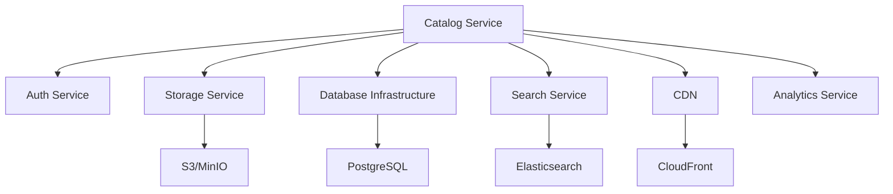

# Architecture Specification: Catalog Service (spec-feature-02)

## Document Overview

**Version**: 1.0
**Last Updated**: November 2025
**Status**: Draft
**Service**: Catalog Service
**Dependencies**: Storage Infrastructure, Database Infrastructure, Authentication, Search Infrastructure

---

## 1. System Overview

### 1.1 Purpose
The Catalog Service manages the comprehensive library of fashion design elements including silhouettes, fabrics, patterns, and design elements. It provides discovery, search, and retrieval capabilities for users to build custom garment designs.

### 1.2 Key Capabilities
- Silhouette library management with 3D models
- Fabric and material database with properties
- Pattern and texture library
- Design elements catalog (collars, sleeves, embellishments)
- Advanced search and filtering
- Catalog administration and curation
- Brand collaboration item management
- Usage analytics and recommendations

### 1.3 Service Boundaries
- **In Scope**: Catalog CRUD operations, search, filtering, recommendations, admin management
- **Out of Scope**: Avatar generation, design creation/editing, rendering
- **Integration Points**: Storage service, search service, authentication service, analytics service

---

## 2. Architecture Components

### 2.1 High-Level Architecture

```
┌─────────────────────────────────────────────────────────────────┐
│                        Catalog Service                           │
├─────────────────────────────────────────────────────────────────┤
│                                                                   │
│  ┌──────────────────┐  ┌──────────────────┐  ┌───────────────┐│
│  │   Public API     │  │   Admin API      │  │  GraphQL API  ││
│  │   (REST)         │  │   (REST)         │  │               ││
│  └────────┬─────────┘  └────────┬─────────┘  └───────┬───────┘│
│           │                     │                     │         │
│  ┌────────┴─────────────────────┴─────────────────────┴──────┐ │
│  │              Application Layer (Controllers)               │ │
│  └────────┬───────────────────────────────────────────────────┘ │
│           │                                                       │
│  ┌────────┴───────────────────────────────────────────────────┐ │
│  │                  Business Logic Layer                       │ │
│  │  ┌──────────────┐  ┌──────────────┐  ┌──────────────┐    │ │
│  │  │ Silhouette   │  │   Fabric     │  │   Pattern    │    │ │
│  │  │   Manager    │  │   Manager    │  │   Manager    │    │ │
│  │  └──────────────┘  └──────────────┘  └──────────────┘    │ │
│  │  ┌──────────────┐  ┌──────────────┐  ┌──────────────┐    │ │
│  │  │   Element    │  │    Search    │  │Recommendation│    │ │
│  │  │   Manager    │  │   Engine     │  │   Engine     │    │ │
│  │  └──────────────┘  └──────────────┘  └──────────────┘    │ │
│  │  ┌──────────────┐  ┌──────────────┐  ┌──────────────┐    │ │
│  │  │   Catalog    │  │   Import     │  │   Analytics  │    │ │
│  │  │   Curator    │  │   Manager    │  │   Tracker    │    │ │
│  │  └──────────────┘  └──────────────┘  └──────────────┘    │ │
│  └────────┬───────────────────────────────────────────────────┘ │
│           │                                                       │
│  ┌────────┴───────────────────────────────────────────────────┐ │
│  │                    Data Access Layer                        │ │
│  │  ┌──────────────┐  ┌──────────────┐  ┌──────────────┐    │ │
│  │  │ Silhouette   │  │   Fabric     │  │   Pattern    │    │ │
│  │  │  Repository  │  │  Repository  │  │  Repository  │    │ │
│  │  └──────────────┘  └──────────────┘  └──────────────┘    │ │
│  └────────────────────────────────────────────────────────────┘ │
│                                                                   │
└───────────────────────────┬───────────────────────────────────────┘
                            │
        ┌───────────────────┼───────────────────┬─────────────┐
        │                   │                   │             │
┌───────▼────────┐ ┌────────▼────────┐ ┌───────▼────────┐ ┌─▼─────────┐
│   PostgreSQL   │ │ Elasticsearch   │ │  S3/Storage    │ │   Redis   │
│   Database     │ │ Search Index    │ │ (Assets/3D)    │ │   Cache   │
└────────────────┘ └─────────────────┘ └────────────────┘ └───────────┘
```

### 2.2 Core Components

#### 2.2.1 Silhouette Manager
- **Responsibility**: Manage garment silhouette library
- **Key Functions**:
  - CRUD operations for silhouettes
  - Category and taxonomy management
  - Size range management
  - Compatibility rules
  - 3D model validation
  - Metadata management
  - Versioning

#### 2.2.2 Fabric Manager
- **Responsibility**: Manage fabric and material library
- **Key Functions**:
  - Fabric CRUD operations
  - Material property management
  - Texture mapping
  - Color palette management
  - Fabric compatibility rules
  - Sustainability certification tracking
  - Seasonal collections

#### 2.2.3 Pattern Manager
- **Responsibility**: Manage pattern and print library
- **Key Functions**:
  - Pattern CRUD operations
  - Texture tiling validation
  - Pattern categorization
  - Color customization
  - Scale and rotation settings
  - Cultural motif management
  - Designer collaboration patterns

#### 2.2.4 Element Manager
- **Responsibility**: Manage design elements catalog
- **Key Functions**:
  - Element CRUD operations
  - Structural element management (collars, sleeves)
  - Embellishment management
  - Hardware element tracking
  - Placement rules
  - Compatibility validation

#### 2.2.5 Search Engine
- **Responsibility**: Advanced search and discovery
- **Key Functions**:
  - Full-text search across catalog
  - Faceted filtering
  - Visual similarity search
  - Keyword matching
  - Relevance scoring
  - Search result ranking
  - Query suggestions

#### 2.2.6 Recommendation Engine
- **Responsibility**: Personalized catalog recommendations
- **Key Functions**:
  - User preference learning
  - Trending item identification
  - Similar item recommendations
  - Style-based suggestions
  - Collaborative filtering
  - Content-based filtering
  - A/B testing support

#### 2.2.7 Catalog Curator
- **Responsibility**: Content curation and quality control
- **Key Functions**:
  - New item review workflow
  - Quality assurance checks
  - Featured collections management
  - Seasonal curation
  - Brand collaboration coordination
  - Content moderation

#### 2.2.8 Import Manager
- **Responsibility**: Bulk import and data migration
- **Key Functions**:
  - Bulk CSV/JSON import
  - 3D model batch upload
  - Data validation
  - Duplicate detection
  - Import job tracking
  - Error handling and recovery

#### 2.2.9 Analytics Tracker
- **Responsibility**: Usage analytics and insights
- **Key Functions**:
  - Item view tracking
  - Usage frequency analysis
  - Popular item identification
  - Conversion tracking
  - A/B test metrics
  - User behavior analysis

---

## 3. Data Models

### 3.1 Core Entities

#### 3.1.1 Silhouette
```typescript
interface Silhouette {
  id: UUID;
  name: string;
  description: string;
  category: SilhouetteCategory;
  subcategory: string;

  // Classification
  garmentType: 'top' | 'bottom' | 'dress' | 'outerwear' | 'traditional';
  gender: 'male' | 'female' | 'unisex';
  seasonality: Season[];
  occasions: Occasion[];

  // Properties
  fitTypes: FitType[]; // slim, regular, relaxed, oversized
  sizeRange: SizeRange;
  constructionComplexity: 1 | 2 | 3 | 4 | 5;
  manufacturingTimeEstimate: number; // hours

  // 3D Model references
  baseModelId: UUID; // Reference to ModelAsset
  previewImageId: UUID; // Reference to ImageAsset
  thumbnailId: UUID; // Reference to ImageAsset

  // Compatibility
  compatibleCategories: string[]; // What can be worn with this
  layerPosition: number; // 1=innermost, higher=outer layers
  fabricRecommendations: UUID[]; // Recommended fabric IDs

  // Metadata
  tags: string[];
  culturalOrigin?: string;
  brandPartnerId?: UUID;
  isPublic: boolean;
  isFeatured: boolean;

  // Versioning
  version: number;
  parentSilhouetteId?: UUID;

  // Analytics
  viewCount: number;
  useCount: number;
  rating?: number;

  // Timestamps
  createdAt: DateTime;
  updatedAt: DateTime;
  createdBy: UUID;
  publishedAt?: DateTime;
}

enum SilhouetteCategory {
  TOPS = 'tops',
  BOTTOMS = 'bottoms',
  DRESSES = 'dresses',
  OUTERWEAR = 'outerwear',
  TRADITIONAL = 'traditional',
  ACTIVEWEAR = 'activewear'
}

enum Season {
  SPRING = 'spring',
  SUMMER = 'summer',
  FALL = 'fall',
  WINTER = 'winter',
  ALL_SEASON = 'all_season'
}

enum Occasion {
  CASUAL = 'casual',
  FORMAL = 'formal',
  BUSINESS = 'business',
  PARTY = 'party',
  FESTIVE = 'festive',
  SPORTS = 'sports',
  WEDDING = 'wedding'
}

interface SizeRange {
  minSize: string; // e.g., 'XS', '0'
  maxSize: string; // e.g., '3XL', '24'
  availableSizes: string[];
}
```

#### 3.1.2 Fabric
```typescript
interface Fabric {
  id: UUID;
  name: string;
  description: string;
  category: FabricCategory;

  // Material composition
  materialType: MaterialType;
  composition: MaterialComposition[];

  // Physical properties
  gsm: number; // Grams per square meter
  stretchPercentage: number;
  breathabilityRating: 1 | 2 | 3 | 4 | 5;
  durabilityScore: 1 | 2 | 3 | 4 | 5;
  careInstructions: CareInstruction[];

  // Visual properties
  baseColor?: string; // Hex color for solids
  textureType: 'smooth' | 'textured' | 'ribbed' | 'waffle' | 'knit';
  weavePattern?: 'plain' | 'twill' | 'satin' | 'jacquard';
  finish?: 'matte' | 'glossy' | 'metallic' | 'distressed';

  // Texture maps (for 3D rendering)
  diffuseMapId?: UUID;
  normalMapId?: UUID;
  roughnessMapId?: UUID;
  metalnessMapId?: UUID;

  // Sustainability
  sustainabilityCertifications: string[];
  sustainabilityScore?: number;

  // Availability
  isAvailable: boolean;
  isPublic: boolean;
  isFeatured: boolean;
  brandPartnerId?: UUID;

  // Pricing (if physical manufacturing)
  basePricePerMeter?: number;
  currency?: string;

  // Seasonality
  seasons: Season[];

  // Metadata
  tags: string[];
  culturalSignificance?: string;

  // Analytics
  viewCount: number;
  useCount: number;
  rating?: number;

  // Timestamps
  createdAt: DateTime;
  updatedAt: DateTime;
  createdBy: UUID;
}

enum FabricCategory {
  NATURAL = 'natural',
  SYNTHETIC = 'synthetic',
  BLEND = 'blend',
  SPECIALTY = 'specialty',
  TECHNICAL = 'technical'
}

enum MaterialType {
  COTTON = 'cotton',
  SILK = 'silk',
  WOOL = 'wool',
  LINEN = 'linen',
  POLYESTER = 'polyester',
  NYLON = 'nylon',
  RAYON = 'rayon',
  SPANDEX = 'spandex',
  DENIM = 'denim',
  LEATHER = 'leather',
  VELVET = 'velvet'
}

interface MaterialComposition {
  material: MaterialType;
  percentage: number;
}

interface CareInstruction {
  type: 'wash' | 'dry' | 'iron' | 'bleach' | 'dryclean';
  instruction: string;
  temperature?: number;
}
```

#### 3.1.3 Pattern
```typescript
interface Pattern {
  id: UUID;
  name: string;
  description: string;
  category: PatternCategory;

  // Pattern type
  patternType: PatternType;

  // Texture assets
  baseTextureId: UUID; // Reference to tiled texture image
  thumbnailId: UUID;
  previewImageId: UUID;

  // Pattern properties
  isTileable: boolean;
  defaultScale: number; // 1.0 = 100%
  minScale: number;
  maxScale: number;
  allowRotation: boolean;
  allowColorCustomization: boolean;

  // Color variants
  colorVariants: ColorVariant[];
  baseColors: string[]; // Hex colors present in pattern

  // Cultural context
  culturalOrigin?: string;
  traditionalName?: string;
  culturalSignificance?: string;

  // Availability
  isPublic: boolean;
  isFeatured: boolean;
  brandPartnerId?: UUID;
  designerCollaborationId?: UUID;

  // Seasonality
  seasons: Season[];
  occasions: Occasion[];

  // Metadata
  tags: string[];
  styleClassification: string[]; // modern, traditional, vintage, etc.

  // Analytics
  viewCount: number;
  useCount: number;
  rating?: number;

  // Timestamps
  createdAt: DateTime;
  updatedAt: DateTime;
  createdBy: UUID;
}

enum PatternCategory {
  GEOMETRIC = 'geometric',
  FLORAL = 'floral',
  ABSTRACT = 'abstract',
  TRADITIONAL = 'traditional',
  ANIMAL = 'animal',
  STRIPE = 'stripe',
  CHECK = 'check',
  DOT = 'dot'
}

enum PatternType {
  PRINT = 'print',
  STRIPE = 'stripe',
  CHECK = 'check',
  PLAID = 'plaid',
  DOT = 'dot',
  PAISLEY = 'paisley',
  FLORAL = 'floral',
  GEOMETRIC = 'geometric',
  ABSTRACT = 'abstract',
  CAMOUFLAGE = 'camouflage',
  EMBROIDERY = 'embroidery'
}

interface ColorVariant {
  id: UUID;
  name: string;
  textureId: UUID; // Colored version of pattern
  primaryColor: string; // Hex
  secondaryColors: string[]; // Hex
}
```

#### 3.1.4 DesignElement
```typescript
interface DesignElement {
  id: UUID;
  name: string;
  description: string;
  category: ElementCategory;
  subcategory: string;

  // Element type
  elementType: ElementType;

  // 3D Model or texture
  modelAssetId?: UUID; // For 3D elements
  textureAssetId?: UUID; // For flat elements
  thumbnailId: UUID;

  // Properties
  isStructural: boolean; // Collar, sleeve (changes silhouette) vs decorative
  compatibleSilhouettes: UUID[]; // Which silhouettes can use this
  placementRules: PlacementRule[];

  // Variations
  variants: ElementVariant[];
  materials: string[]; // Wood, metal, plastic, etc. for buttons/hardware

  // Size and scale
  defaultSize: number;
  minSize: number;
  maxSize: number;
  allowCustomScale: boolean;

  // Availability
  isPublic: boolean;
  isFeatured: boolean;
  brandPartnerId?: UUID;

  // Metadata
  tags: string[];
  styleClassification: string[];

  // Analytics
  viewCount: number;
  useCount: number;
  rating?: number;

  // Timestamps
  createdAt: DateTime;
  updatedAt: DateTime;
  createdBy: UUID;
}

enum ElementCategory {
  COLLAR = 'collar',
  SLEEVE = 'sleeve',
  CUFF = 'cuff',
  POCKET = 'pocket',
  HEM = 'hem',
  CLOSURE = 'closure',
  EMBELLISHMENT = 'embellishment',
  HARDWARE = 'hardware'
}

enum ElementType {
  // Structural
  COLLAR_ROUND = 'collar_round',
  COLLAR_V = 'collar_v',
  COLLAR_MANDARIN = 'collar_mandarin',
  SLEEVE_FULL = 'sleeve_full',
  SLEEVE_HALF = 'sleeve_half',
  SLEEVE_PUFF = 'sleeve_puff',
  POCKET_PATCH = 'pocket_patch',
  POCKET_WELT = 'pocket_welt',

  // Embellishments
  EMBROIDERY = 'embroidery',
  SEQUINS = 'sequins',
  BEADWORK = 'beadwork',
  APPLIQUE = 'applique',
  LACE = 'lace',

  // Hardware
  BUTTON = 'button',
  ZIPPER = 'zipper',
  BUCKLE = 'buckle',
  STUD = 'stud'
}

interface PlacementRule {
  zone: 'collar' | 'chest' | 'sleeve' | 'waist' | 'hem' | 'pocket' | 'back';
  allowMultiple: boolean;
  maxCount?: number;
  symmetryRequired: boolean;
}

interface ElementVariant {
  id: UUID;
  name: string;
  assetId: UUID;
  properties: Record<string, any>;
}
```

#### 3.1.5 ModelAsset
```typescript
interface ModelAsset {
  id: UUID;
  name: string;
  assetType: 'silhouette' | 'element' | 'accessory';

  // File storage
  storageKey: string;
  storageBucket: string;
  format: 'gltf' | 'glb' | 'fbx' | 'obj';
  fileSize: number;

  // Model properties
  vertexCount: number;
  faceCount: number;
  hasUVMapping: boolean;
  hasSkeleton: boolean;
  hasAnimations: boolean;

  // LOD variants
  lodVariants: LODVariant[];

  // Bounding box
  boundingBox: {
    width: number;
    height: number;
    depth: number;
  };

  // Processing status
  status: 'pending' | 'processing' | 'completed' | 'failed';
  processingError?: string;

  // Metadata
  version: number;

  // Timestamps
  createdAt: DateTime;
  uploadedBy: UUID;
}

interface LODVariant {
  lodLevel: 'high' | 'medium' | 'low' | 'mobile';
  storageKey: string;
  vertexCount: number;
  fileSize: number;
}
```

#### 3.1.6 ImageAsset
```typescript
interface ImageAsset {
  id: UUID;
  assetType: 'thumbnail' | 'preview' | 'texture' | 'pattern';

  // File storage
  storageKey: string;
  storageBucket: string;
  format: 'png' | 'jpg' | 'webp';
  fileSize: number;

  // Image properties
  width: number;
  height: number;
  hasAlpha: boolean;

  // Texture properties (if applicable)
  isTileable?: boolean;
  textureType?: 'diffuse' | 'normal' | 'roughness' | 'metalness';

  // Variants
  variants: ImageVariant[];

  // Timestamps
  createdAt: DateTime;
  uploadedBy: UUID;
}

interface ImageVariant {
  size: 'thumbnail' | 'small' | 'medium' | 'large' | 'original';
  storageKey: string;
  width: number;
  height: number;
  fileSize: number;
}
```

#### 3.1.7 Collection
```typescript
interface Collection {
  id: UUID;
  name: string;
  description: string;
  collectionType: 'seasonal' | 'featured' | 'trending' | 'brand' | 'designer' | 'curated';

  // Items
  items: CollectionItem[];

  // Visibility
  isPublic: boolean;
  isFeatured: boolean;

  // Brand/Designer
  brandPartnerId?: UUID;
  designerCollaboratorId?: UUID;

  // Timing
  activeFrom?: DateTime;
  activeTo?: DateTime;

  // Metadata
  tags: string[];
  coverImageId?: UUID;

  // Analytics
  viewCount: number;

  // Timestamps
  createdAt: DateTime;
  updatedAt: DateTime;
  createdBy: UUID;
}

interface CollectionItem {
  itemId: UUID;
  itemType: 'silhouette' | 'fabric' | 'pattern' | 'element';
  order: number;
}
```

### 3.2 Database Schema

```sql
-- Silhouettes table
CREATE TABLE silhouettes (
  id UUID PRIMARY KEY DEFAULT gen_random_uuid(),
  name VARCHAR(255) NOT NULL,
  description TEXT,
  category VARCHAR(100) NOT NULL,
  subcategory VARCHAR(100),
  garment_type VARCHAR(50) NOT NULL,
  gender VARCHAR(20) NOT NULL DEFAULT 'unisex',
  seasonality TEXT[] DEFAULT '{}',
  occasions TEXT[] DEFAULT '{}',

  -- Properties
  fit_types TEXT[] NOT NULL,
  size_range JSONB NOT NULL,
  construction_complexity INTEGER CHECK (construction_complexity BETWEEN 1 AND 5),
  manufacturing_time_estimate INTEGER,

  -- Model references
  base_model_id UUID REFERENCES model_assets(id) ON DELETE SET NULL,
  preview_image_id UUID REFERENCES image_assets(id) ON DELETE SET NULL,
  thumbnail_id UUID REFERENCES image_assets(id) ON DELETE SET NULL,

  -- Compatibility
  compatible_categories TEXT[] DEFAULT '{}',
  layer_position INTEGER NOT NULL DEFAULT 1,
  fabric_recommendations UUID[] DEFAULT '{}',

  -- Metadata
  tags TEXT[] DEFAULT '{}',
  cultural_origin VARCHAR(255),
  brand_partner_id UUID REFERENCES brand_partners(id) ON DELETE SET NULL,
  is_public BOOLEAN DEFAULT true,
  is_featured BOOLEAN DEFAULT false,

  -- Versioning
  version INTEGER DEFAULT 1,
  parent_silhouette_id UUID REFERENCES silhouettes(id) ON DELETE SET NULL,

  -- Analytics
  view_count INTEGER DEFAULT 0,
  use_count INTEGER DEFAULT 0,
  rating DECIMAL(3,2),

  -- Timestamps
  created_at TIMESTAMP WITH TIME ZONE DEFAULT CURRENT_TIMESTAMP,
  updated_at TIMESTAMP WITH TIME ZONE DEFAULT CURRENT_TIMESTAMP,
  created_by UUID NOT NULL REFERENCES users(id) ON DELETE SET NULL,
  published_at TIMESTAMP WITH TIME ZONE
);

CREATE INDEX idx_silhouettes_category ON silhouettes(category);
CREATE INDEX idx_silhouettes_garment_type ON silhouettes(garment_type);
CREATE INDEX idx_silhouettes_is_public ON silhouettes(is_public);
CREATE INDEX idx_silhouettes_is_featured ON silhouettes(is_featured);
CREATE INDEX idx_silhouettes_tags ON silhouettes USING GIN(tags);
CREATE INDEX idx_silhouettes_view_count ON silhouettes(view_count DESC);
CREATE INDEX idx_silhouettes_created_at ON silhouettes(created_at DESC);

-- Full-text search
CREATE INDEX idx_silhouettes_search ON silhouettes
  USING GIN(to_tsvector('english', name || ' ' || COALESCE(description, '')));

-- Fabrics table
CREATE TABLE fabrics (
  id UUID PRIMARY KEY DEFAULT gen_random_uuid(),
  name VARCHAR(255) NOT NULL,
  description TEXT,
  category VARCHAR(100) NOT NULL,
  material_type VARCHAR(100) NOT NULL,
  composition JSONB NOT NULL,

  -- Physical properties
  gsm INTEGER,
  stretch_percentage INTEGER,
  breathability_rating INTEGER CHECK (breathability_rating BETWEEN 1 AND 5),
  durability_score INTEGER CHECK (durability_score BETWEEN 1 AND 5),
  care_instructions JSONB DEFAULT '[]',

  -- Visual properties
  base_color VARCHAR(7), -- Hex color
  texture_type VARCHAR(50),
  weave_pattern VARCHAR(50),
  finish VARCHAR(50),

  -- Texture map references
  diffuse_map_id UUID REFERENCES image_assets(id) ON DELETE SET NULL,
  normal_map_id UUID REFERENCES image_assets(id) ON DELETE SET NULL,
  roughness_map_id UUID REFERENCES image_assets(id) ON DELETE SET NULL,
  metalness_map_id UUID REFERENCES image_assets(id) ON DELETE SET NULL,

  -- Sustainability
  sustainability_certifications TEXT[] DEFAULT '{}',
  sustainability_score INTEGER,

  -- Availability
  is_available BOOLEAN DEFAULT true,
  is_public BOOLEAN DEFAULT true,
  is_featured BOOLEAN DEFAULT false,
  brand_partner_id UUID REFERENCES brand_partners(id) ON DELETE SET NULL,

  -- Pricing
  base_price_per_meter DECIMAL(10,2),
  currency VARCHAR(3),

  -- Seasonality
  seasons TEXT[] DEFAULT '{}',

  -- Metadata
  tags TEXT[] DEFAULT '{}',
  cultural_significance TEXT,

  -- Analytics
  view_count INTEGER DEFAULT 0,
  use_count INTEGER DEFAULT 0,
  rating DECIMAL(3,2),

  -- Timestamps
  created_at TIMESTAMP WITH TIME ZONE DEFAULT CURRENT_TIMESTAMP,
  updated_at TIMESTAMP WITH TIME ZONE DEFAULT CURRENT_TIMESTAMP,
  created_by UUID NOT NULL REFERENCES users(id) ON DELETE SET NULL
);

CREATE INDEX idx_fabrics_category ON fabrics(category);
CREATE INDEX idx_fabrics_material_type ON fabrics(material_type);
CREATE INDEX idx_fabrics_is_public ON fabrics(is_public);
CREATE INDEX idx_fabrics_tags ON fabrics USING GIN(tags);
CREATE INDEX idx_fabrics_view_count ON fabrics(view_count DESC);
CREATE INDEX idx_fabrics_search ON fabrics
  USING GIN(to_tsvector('english', name || ' ' || COALESCE(description, '')));

-- Patterns table
CREATE TABLE patterns (
  id UUID PRIMARY KEY DEFAULT gen_random_uuid(),
  name VARCHAR(255) NOT NULL,
  description TEXT,
  category VARCHAR(100) NOT NULL,
  pattern_type VARCHAR(100) NOT NULL,

  -- Texture assets
  base_texture_id UUID REFERENCES image_assets(id) ON DELETE SET NULL,
  thumbnail_id UUID REFERENCES image_assets(id) ON DELETE SET NULL,
  preview_image_id UUID REFERENCES image_assets(id) ON DELETE SET NULL,

  -- Pattern properties
  is_tileable BOOLEAN DEFAULT true,
  default_scale DECIMAL(5,2) DEFAULT 1.0,
  min_scale DECIMAL(5,2) DEFAULT 0.5,
  max_scale DECIMAL(5,2) DEFAULT 3.0,
  allow_rotation BOOLEAN DEFAULT true,
  allow_color_customization BOOLEAN DEFAULT true,

  -- Color variants
  color_variants JSONB DEFAULT '[]',
  base_colors TEXT[] DEFAULT '{}',

  -- Cultural context
  cultural_origin VARCHAR(255),
  traditional_name VARCHAR(255),
  cultural_significance TEXT,

  -- Availability
  is_public BOOLEAN DEFAULT true,
  is_featured BOOLEAN DEFAULT false,
  brand_partner_id UUID REFERENCES brand_partners(id) ON DELETE SET NULL,
  designer_collaboration_id UUID,

  -- Seasonality
  seasons TEXT[] DEFAULT '{}',
  occasions TEXT[] DEFAULT '{}',

  -- Metadata
  tags TEXT[] DEFAULT '{}',
  style_classification TEXT[] DEFAULT '{}',

  -- Analytics
  view_count INTEGER DEFAULT 0,
  use_count INTEGER DEFAULT 0,
  rating DECIMAL(3,2),

  -- Timestamps
  created_at TIMESTAMP WITH TIME ZONE DEFAULT CURRENT_TIMESTAMP,
  updated_at TIMESTAMP WITH TIME ZONE DEFAULT CURRENT_TIMESTAMP,
  created_by UUID NOT NULL REFERENCES users(id) ON DELETE SET NULL
);

CREATE INDEX idx_patterns_category ON patterns(category);
CREATE INDEX idx_patterns_pattern_type ON patterns(pattern_type);
CREATE INDEX idx_patterns_is_public ON patterns(is_public);
CREATE INDEX idx_patterns_tags ON patterns USING GIN(tags);
CREATE INDEX idx_patterns_view_count ON patterns(view_count DESC);
CREATE INDEX idx_patterns_search ON patterns
  USING GIN(to_tsvector('english', name || ' ' || COALESCE(description, '')));

-- Design elements table
CREATE TABLE design_elements (
  id UUID PRIMARY KEY DEFAULT gen_random_uuid(),
  name VARCHAR(255) NOT NULL,
  description TEXT,
  category VARCHAR(100) NOT NULL,
  subcategory VARCHAR(100),
  element_type VARCHAR(100) NOT NULL,

  -- Assets
  model_asset_id UUID REFERENCES model_assets(id) ON DELETE SET NULL,
  texture_asset_id UUID REFERENCES image_assets(id) ON DELETE SET NULL,
  thumbnail_id UUID REFERENCES image_assets(id) ON DELETE SET NULL,

  -- Properties
  is_structural BOOLEAN DEFAULT false,
  compatible_silhouettes UUID[] DEFAULT '{}',
  placement_rules JSONB DEFAULT '[]',
  variants JSONB DEFAULT '[]',
  materials TEXT[] DEFAULT '{}',

  -- Size
  default_size DECIMAL(6,2),
  min_size DECIMAL(6,2),
  max_size DECIMAL(6,2),
  allow_custom_scale BOOLEAN DEFAULT true,

  -- Availability
  is_public BOOLEAN DEFAULT true,
  is_featured BOOLEAN DEFAULT false,
  brand_partner_id UUID REFERENCES brand_partners(id) ON DELETE SET NULL,

  -- Metadata
  tags TEXT[] DEFAULT '{}',
  style_classification TEXT[] DEFAULT '{}',

  -- Analytics
  view_count INTEGER DEFAULT 0,
  use_count INTEGER DEFAULT 0,
  rating DECIMAL(3,2),

  -- Timestamps
  created_at TIMESTAMP WITH TIME ZONE DEFAULT CURRENT_TIMESTAMP,
  updated_at TIMESTAMP WITH TIME ZONE DEFAULT CURRENT_TIMESTAMP,
  created_by UUID NOT NULL REFERENCES users(id) ON DELETE SET NULL
);

CREATE INDEX idx_design_elements_category ON design_elements(category);
CREATE INDEX idx_design_elements_element_type ON design_elements(element_type);
CREATE INDEX idx_design_elements_is_public ON design_elements(is_public);
CREATE INDEX idx_design_elements_tags ON design_elements USING GIN(tags);
CREATE INDEX idx_design_elements_search ON design_elements
  USING GIN(to_tsvector('english', name || ' ' || COALESCE(description, '')));

-- Model assets table
CREATE TABLE model_assets (
  id UUID PRIMARY KEY DEFAULT gen_random_uuid(),
  name VARCHAR(255) NOT NULL,
  asset_type VARCHAR(50) NOT NULL,

  -- Storage
  storage_key VARCHAR(500) NOT NULL,
  storage_bucket VARCHAR(200) NOT NULL,
  format VARCHAR(20) NOT NULL,
  file_size INTEGER NOT NULL,

  -- Properties
  vertex_count INTEGER,
  face_count INTEGER,
  has_uv_mapping BOOLEAN DEFAULT false,
  has_skeleton BOOLEAN DEFAULT false,
  has_animations BOOLEAN DEFAULT false,

  -- LOD variants
  lod_variants JSONB DEFAULT '[]',

  -- Bounding box
  bounding_box JSONB,

  -- Processing
  status VARCHAR(50) DEFAULT 'pending',
  processing_error TEXT,

  -- Versioning
  version INTEGER DEFAULT 1,

  -- Timestamps
  created_at TIMESTAMP WITH TIME ZONE DEFAULT CURRENT_TIMESTAMP,
  uploaded_by UUID NOT NULL REFERENCES users(id) ON DELETE SET NULL
);

CREATE INDEX idx_model_assets_asset_type ON model_assets(asset_type);
CREATE INDEX idx_model_assets_status ON model_assets(status);

-- Image assets table
CREATE TABLE image_assets (
  id UUID PRIMARY KEY DEFAULT gen_random_uuid(),
  asset_type VARCHAR(50) NOT NULL,

  -- Storage
  storage_key VARCHAR(500) NOT NULL,
  storage_bucket VARCHAR(200) NOT NULL,
  format VARCHAR(20) NOT NULL,
  file_size INTEGER NOT NULL,

  -- Properties
  width INTEGER NOT NULL,
  height INTEGER NOT NULL,
  has_alpha BOOLEAN DEFAULT false,

  -- Texture properties
  is_tileable BOOLEAN,
  texture_type VARCHAR(50),

  -- Variants
  variants JSONB DEFAULT '[]',

  -- Timestamps
  created_at TIMESTAMP WITH TIME ZONE DEFAULT CURRENT_TIMESTAMP,
  uploaded_by UUID NOT NULL REFERENCES users(id) ON DELETE SET NULL
);

CREATE INDEX idx_image_assets_asset_type ON image_assets(asset_type);

-- Collections table
CREATE TABLE collections (
  id UUID PRIMARY KEY DEFAULT gen_random_uuid(),
  name VARCHAR(255) NOT NULL,
  description TEXT,
  collection_type VARCHAR(50) NOT NULL,

  -- Items
  items JSONB DEFAULT '[]',

  -- Visibility
  is_public BOOLEAN DEFAULT true,
  is_featured BOOLEAN DEFAULT false,

  -- Brand/Designer
  brand_partner_id UUID REFERENCES brand_partners(id) ON DELETE SET NULL,
  designer_collaborator_id UUID,

  -- Timing
  active_from TIMESTAMP WITH TIME ZONE,
  active_to TIMESTAMP WITH TIME ZONE,

  -- Metadata
  tags TEXT[] DEFAULT '{}',
  cover_image_id UUID REFERENCES image_assets(id) ON DELETE SET NULL,

  -- Analytics
  view_count INTEGER DEFAULT 0,

  -- Timestamps
  created_at TIMESTAMP WITH TIME ZONE DEFAULT CURRENT_TIMESTAMP,
  updated_at TIMESTAMP WITH TIME ZONE DEFAULT CURRENT_TIMESTAMP,
  created_by UUID NOT NULL REFERENCES users(id) ON DELETE SET NULL
);

CREATE INDEX idx_collections_collection_type ON collections(collection_type);
CREATE INDEX idx_collections_is_public ON collections(is_public);
CREATE INDEX idx_collections_active_dates ON collections(active_from, active_to);
```

---

## 4. API Design

### 4.1 RESTful API Endpoints

#### 4.1.1 Silhouettes

```
GET    /api/v1/silhouettes
GET    /api/v1/silhouettes/:id
POST   /api/v1/silhouettes (Admin)
PUT    /api/v1/silhouettes/:id (Admin)
DELETE /api/v1/silhouettes/:id (Admin)
GET    /api/v1/silhouettes/categories
GET    /api/v1/silhouettes/featured
GET    /api/v1/silhouettes/trending
GET    /api/v1/silhouettes/:id/compatible-items
```

#### 4.1.2 Fabrics

```
GET    /api/v1/fabrics
GET    /api/v1/fabrics/:id
POST   /api/v1/fabrics (Admin)
PUT    /api/v1/fabrics/:id (Admin)
DELETE /api/v1/fabrics/:id (Admin)
GET    /api/v1/fabrics/categories
GET    /api/v1/fabrics/featured
GET    /api/v1/fabrics/:id/color-variants
```

#### 4.1.3 Patterns

```
GET    /api/v1/patterns
GET    /api/v1/patterns/:id
POST   /api/v1/patterns (Admin)
PUT    /api/v1/patterns/:id (Admin)
DELETE /api/v1/patterns/:id (Admin)
GET    /api/v1/patterns/featured
GET    /api/v1/patterns/:id/color-variants
```

#### 4.1.4 Design Elements

```
GET    /api/v1/elements
GET    /api/v1/elements/:id
POST   /api/v1/elements (Admin)
PUT    /api/v1/elements/:id (Admin)
DELETE /api/v1/elements/:id (Admin)
GET    /api/v1/elements/categories
```

#### 4.1.5 Search & Discovery

```
GET    /api/v1/catalog/search
GET    /api/v1/catalog/filters
GET    /api/v1/catalog/recommendations
GET    /api/v1/catalog/trending
GET    /api/v1/catalog/similar/:itemType/:itemId
```

#### 4.1.6 Collections

```
GET    /api/v1/collections
GET    /api/v1/collections/:id
POST   /api/v1/collections (Admin)
PUT    /api/v1/collections/:id (Admin)
DELETE /api/v1/collections/:id (Admin)
GET    /api/v1/collections/featured
```

### 4.2 API Specifications

#### 4.2.1 Get Silhouettes (with filtering)

```http
GET /api/v1/silhouettes?category=tops&season=summer&occasion=casual&page=1&limit=20
Authorization: Bearer <token>

Response: 200 OK
{
  "data": [
    {
      "id": "uuid",
      "name": "Classic T-Shirt",
      "description": "Versatile round neck t-shirt silhouette",
      "category": "tops",
      "garmentType": "top",
      "fitTypes": ["slim", "regular", "relaxed"],
      "seasons": ["spring", "summer", "all_season"],
      "occasions": ["casual"],
      "thumbnail": {
        "url": "https://cdn.example.com/thumbnails/...",
        "width": 300,
        "height": 400
      },
      "previewImage": {
        "url": "https://cdn.example.com/previews/...",
        "width": 800,
        "height": 1200
      },
      "tags": ["basic", "essential", "versatile"],
      "isFeatured": false,
      "viewCount": 1543,
      "useCount": 892,
      "rating": 4.5
    }
  ],
  "pagination": {
    "page": 1,
    "limit": 20,
    "total": 156,
    "totalPages": 8
  },
  "filters": {
    "appliedFilters": {
      "category": "tops",
      "season": "summer",
      "occasion": "casual"
    },
    "availableFilters": {
      "fitTypes": ["slim", "regular", "relaxed", "oversized"],
      "subcategories": ["t-shirts", "blouses", "shirts"]
    }
  }
}
```

#### 4.2.2 Search Catalog

```http
GET /api/v1/catalog/search?q=floral&type=pattern,fabric&season=summer&page=1&limit=50
Authorization: Bearer <token>

Response: 200 OK
{
  "query": "floral",
  "results": [
    {
      "type": "pattern",
      "id": "uuid",
      "name": "Summer Floral Print",
      "description": "Bright and cheerful floral pattern",
      "thumbnail": "https://cdn.example.com/...",
      "relevanceScore": 0.95,
      "tags": ["floral", "summer", "bright"],
      "category": "floral"
    },
    {
      "type": "fabric",
      "id": "uuid",
      "name": "Floral Silk",
      "description": "Lightweight silk with subtle floral texture",
      "thumbnail": "https://cdn.example.com/...",
      "relevanceScore": 0.87,
      "tags": ["silk", "floral", "luxury"]
    }
  ],
  "pagination": {
    "page": 1,
    "limit": 50,
    "total": 87
  },
  "suggestions": ["tropical floral", "vintage floral", "abstract floral"]
}
```

#### 4.2.3 Get Recommendations

```http
GET /api/v1/catalog/recommendations?context=design&avatarId=uuid&limit=10
Authorization: Bearer <token>

Response: 200 OK
{
  "recommendations": [
    {
      "type": "silhouette",
      "id": "uuid",
      "name": "A-Line Dress",
      "reason": "Recommended for your body type (hourglass)",
      "confidence": 0.92,
      "thumbnail": "https://cdn.example.com/..."
    },
    {
      "type": "fabric",
      "id": "uuid",
      "name": "Cotton Blend",
      "reason": "Popular choice for summer casual wear",
      "confidence": 0.85,
      "thumbnail": "https://cdn.example.com/..."
    }
  ]
}
```

### 4.3 GraphQL Schema

```graphql
type Silhouette {
  id: ID!
  name: String!
  description: String
  category: SilhouetteCategory!
  subcategory: String
  garmentType: GarmentType!
  gender: Gender!
  seasonality: [Season!]!
  occasions: [Occasion!]!
  fitTypes: [FitType!]!
  sizeRange: SizeRange!
  baseModel: ModelAsset
  previewImage: ImageAsset
  thumbnail: ImageAsset
  compatibleCategories: [String!]!
  fabricRecommendations: [Fabric!]!
  tags: [String!]!
  isFeatured: Boolean!
  viewCount: Int!
  useCount: Int!
  rating: Float
  createdAt: DateTime!
}

type Fabric {
  id: ID!
  name: String!
  description: String
  category: FabricCategory!
  materialType: MaterialType!
  composition: [MaterialComposition!]!
  gsm: Int
  stretchPercentage: Int
  textureType: String
  diffuseMap: ImageAsset
  normalMap: ImageAsset
  seasons: [Season!]!
  tags: [String!]!
  isFeatured: Boolean!
  sustainabilityCertifications: [String!]!
}

type Pattern {
  id: ID!
  name: String!
  description: String
  category: PatternCategory!
  patternType: PatternType!
  baseTexture: ImageAsset!
  thumbnail: ImageAsset!
  isTileable: Boolean!
  defaultScale: Float!
  allowColorCustomization: Boolean!
  colorVariants: [ColorVariant!]!
  tags: [String!]!
  isFeatured: Boolean!
}

type DesignElement {
  id: ID!
  name: String!
  description: String
  category: ElementCategory!
  elementType: ElementType!
  isStructural: Boolean!
  modelAsset: ModelAsset
  thumbnail: ImageAsset!
  compatibleSilhouettes: [Silhouette!]!
  variants: [ElementVariant!]!
}

type Collection {
  id: ID!
  name: String!
  description: String
  collectionType: CollectionType!
  items: [CollectionItem!]!
  isPublic: Boolean!
  isFeatured: Boolean!
  coverImage: ImageAsset
  activeFrom: DateTime
  activeTo: DateTime
}

# Queries
type Query {
  silhouettes(filter: SilhouetteFilter, pagination: Pagination): SilhouetteConnection!
  silhouette(id: ID!): Silhouette

  fabrics(filter: FabricFilter, pagination: Pagination): FabricConnection!
  fabric(id: ID!): Fabric

  patterns(filter: PatternFilter, pagination: Pagination): PatternConnection!
  pattern(id: ID!): Pattern

  designElements(filter: ElementFilter, pagination: Pagination): ElementConnection!
  designElement(id: ID!): DesignElement

  searchCatalog(query: String!, types: [CatalogType!], filter: CatalogFilter): CatalogSearchResult!
  recommendations(context: RecommendationContext!): [Recommendation!]!

  collections(filter: CollectionFilter): [Collection!]!
  collection(id: ID!): Collection
}

# Mutations (Admin only)
type Mutation {
  createSilhouette(input: CreateSilhouetteInput!): Silhouette!
  updateSilhouette(id: ID!, input: UpdateSilhouetteInput!): Silhouette!
  deleteSilhouette(id: ID!): Boolean!

  createFabric(input: CreateFabricInput!): Fabric!
  updateFabric(id: ID!, input: UpdateFabricInput!): Fabric!
  deleteFabric(id: ID!): Boolean!

  createPattern(input: CreatePatternInput!): Pattern!
  updatePattern(id: ID!, input: UpdatePatternInput!): Pattern!
  deletePattern(id: ID!): Boolean!

  createDesignElement(input: CreateElementInput!): DesignElement!
  updateDesignElement(id: ID!, input: UpdateElementInput!): DesignElement!
  deleteDesignElement(id: ID!): Boolean!

  bulkImportCatalog(input: BulkImportInput!): BulkImportResult!
}
```

---

## 5. Technology Stack

### 5.1 Backend Services

#### Primary Stack
- **Runtime**: Node.js 20 LTS + TypeScript 5.3
- **Framework**: NestJS or Express.js
- **API Layer**: REST (Express) + GraphQL (Apollo Server)
- **Validation**: Zod or Joi

### 5.2 Data Storage

- **Primary Database**: PostgreSQL 16 (metadata, relationships)
- **Search Engine**: Elasticsearch 8 or PostgreSQL Full-Text Search
- **Object Storage**: AWS S3 / MinIO (3D models, textures, images)
- **Cache Layer**: Redis 7 (frequent queries, filters)
- **CDN**: CloudFront or CloudFlare (asset delivery)

### 5.3 Image & Asset Processing

- **Image Processing**: Sharp (Node.js)
- **3D Model Validation**: Three.js (backend), custom validators
- **Thumbnail Generation**: Sharp
- **Image Optimization**: ImageMagick, WebP conversion

### 5.4 Search & Recommendations

- **Full-Text Search**: Elasticsearch or PostgreSQL tsvector
- **Vector Search**: pgvector (for visual similarity)
- **Recommendation Engine**: Custom collaborative filtering
- **ML Models**: TensorFlow.js (optional for image-based recommendations)

### 5.5 Monitoring & Observability

- **Logging**: Winston + ELK Stack
- **Metrics**: Prometheus + Grafana
- **Tracing**: OpenTelemetry + Jaeger
- **Error Tracking**: Sentry
- **CDN Analytics**: CloudFlare Analytics

---

## 6. System Interactions

### 6.1 Service Dependencies



### 6.2 External Integrations

- **Authentication**: JWT token validation
- **Storage**: Pre-signed URLs for asset upload/download
- **CDN**: Asset delivery optimization
- **Analytics**: Usage tracking and behavior analysis
- **Brand Partners**: API for brand-specific catalogs

---

## 7. Deployment Architecture

### 7.1 Kubernetes Deployment

```yaml
apiVersion: apps/v1
kind: Deployment
metadata:
  name: catalog-service-api
spec:
  replicas: 5
  selector:
    matchLabels:
      app: catalog-service-api
  template:
    spec:
      containers:
      - name: api
        image: catalog-service:latest
        ports:
        - containerPort: 3000
        resources:
          requests:
            memory: "512Mi"
            cpu: "500m"
          limits:
            memory: "1Gi"
            cpu: "1000m"
---
apiVersion: autoscaling/v2
kind: HorizontalPodAutoscaler
metadata:
  name: catalog-service-hpa
spec:
  scaleTargetRef:
    apiVersion: apps/v1
    kind: Deployment
    name: catalog-service-api
  minReplicas: 5
  maxReplicas: 20
  metrics:
  - type: Resource
    resource:
      name: cpu
      target:
        type: Utilization
        averageUtilization: 70
```

---

## 8. Security Architecture

### 8.1 Authentication & Authorization

- **Public Read Access**: Most catalog endpoints public
- **Admin Write Access**: RBAC for catalog management
- **Rate Limiting**: Per-IP and per-user limits
- **API Keys**: For brand partner integrations

### 8.2 Data Protection

- **Asset Encryption**: S3 server-side encryption
- **CDN Security**: Signed URLs for premium content
- **Input Validation**: File upload validation, size limits
- **SQL Injection**: Parameterized queries, ORM

---

## 9. Performance Requirements

### 9.1 Response Time Targets

- Catalog list/search: < 200ms (p95)
- Single item retrieval: < 100ms (p95)
- Asset download via CDN: < 2s for 5MB file
- Search with filters: < 300ms (p95)

### 9.2 Throughput

- 10,000 concurrent catalog browsing users
- 1,000 req/sec for search operations
- 100 GB/day asset downloads

### 9.3 Catalog Limits

- Initial catalog: 10,000+ items
- Target: 50,000+ items
- Asset size: 3D models < 10MB, textures < 5MB

---

## 10. Development Phases

### Phase 1: Core Catalog (Weeks 1-2)
- Database schema
- Silhouette CRUD APIs
- Basic search and filtering
- Asset storage integration

### Phase 2: Fabrics & Patterns (Weeks 3-4)
- Fabric management APIs
- Pattern management APIs
- Texture asset handling
- Color management

### Phase 3: Design Elements (Week 5)
- Element management APIs
- Placement rules
- Compatibility system

### Phase 4: Search & Discovery (Weeks 6-7)
- Elasticsearch integration
- Advanced filtering
- Search relevance tuning
- Trending and featured items

### Phase 5: Recommendations (Weeks 8-9)
- Recommendation engine
- Analytics integration
- Personalization logic

### Phase 6: Admin Tools (Week 10)
- Admin dashboard
- Bulk import tools
- Curation workflows

---

## Document Metadata

**Version**: 1.0
**Last Updated**: November 2025
**Author**: Architecture Team
**Status**: Draft

---

**End of Architecture Specification**
