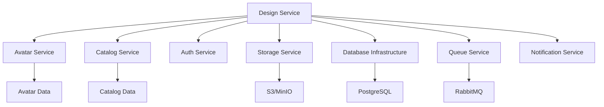

# Architecture Specification: Design Service (spec-feature-03)

## Document Overview

**Version**: 1.0
**Last Updated**: November 2025
**Status**: Draft
**Service**: Design Service
**Dependencies**: Avatar Service, Catalog Service, Storage Infrastructure, Database Infrastructure, Authentication

---

## 1. System Overview

### 1.1 Purpose
The Design Service enables users to create, customize, save, and manage garment designs by combining avatars with catalog items (silhouettes, fabrics, patterns, embellishments). It provides the core design workspace functionality with layer management, real-time 3D preview coordination, and design persistence.

### 1.2 Key Capabilities
- Design project creation and management
- Layer-based design composition
- Avatar-garment fitting and visualization coordination
- Design customization (fabric, color, pattern application)
- Design versioning and history
- Collaboration and sharing
- Export and rendering coordination
- Design validation and recommendations

### 1.3 Service Boundaries
- **In Scope**: Design CRUD, layer management, design state management, validation, export coordination
- **Out of Scope**: 3D rendering (frontend), avatar generation, catalog management, actual file rendering
- **Integration Points**: Avatar service, catalog service, storage service, notification service

---

## 2. Architecture Components

### 2.1 High-Level Architecture

```
┌─────────────────────────────────────────────────────────────────┐
│                        Design Service                            │
├─────────────────────────────────────────────────────────────────┤
│                                                                   │
│  ┌──────────────────┐  ┌──────────────────┐  ┌───────────────┐│
│  │   REST API       │  │   GraphQL API    │  │  WebSocket    ││
│  │                  │  │                  │  │  Server       ││
│  └────────┬─────────┘  └────────┬─────────┘  └───────┬───────┘│
│           │                     │                     │         │
│  ┌────────┴─────────────────────┴─────────────────────┴──────┐ │
│  │              Application Layer (Controllers)               │ │
│  └────────┬───────────────────────────────────────────────────┘ │
│           │                                                       │
│  ┌────────┴───────────────────────────────────────────────────┐ │
│  │                  Business Logic Layer                       │ │
│  │  ┌──────────────┐  ┌──────────────┐  ┌──────────────┐    │ │
│  │  │   Design     │  │    Layer     │  │   Version    │    │ │
│  │  │   Manager    │  │   Manager    │  │   Manager    │    │ │
│  │  └──────────────┘  └──────────────┘  └──────────────┘    │ │
│  │  ┌──────────────┐  ┌──────────────┐  ┌──────────────┐    │ │
│  │  │Customization │  │  Validation  │  │   Export     │    │ │
│  │  │   Engine     │  │   Engine     │  │   Manager    │    │ │
│  │  └──────────────┘  └──────────────┘  └──────────────┘    │ │
│  │  ┌──────────────┐  ┌──────────────┐  ┌──────────────┐    │ │
│  │  │Collaboration │  │   Render     │  │  Analytics   │    │ │
│  │  │   Manager    │  │  Coordinator │  │   Tracker    │    │ │
│  │  └──────────────┘  └──────────────┘  └──────────────┘    │ │
│  └────────┬───────────────────────────────────────────────────┘ │
│           │                                                       │
│  ┌────────┴───────────────────────────────────────────────────┐ │
│  │                    Data Access Layer                        │ │
│  │  ┌──────────────┐  ┌──────────────┐  ┌──────────────┐    │ │
│  │  │   Design     │  │    Layer     │  │   Version    │    │ │
│  │  │  Repository  │  │  Repository  │  │  Repository  │    │ │
│  │  └──────────────┘  └──────────────┘  └──────────────┘    │ │
│  └────────────────────────────────────────────────────────────┘ │
│                                                                   │
└───────────────────────────┬───────────────────────────────────────┘
                            │
        ┌───────────────────┼───────────────────┬─────────────┐
        │                   │                   │             │
┌───────▼────────┐ ┌────────▼────────┐ ┌───────▼────────┐ ┌─▼─────────┐
│   PostgreSQL   │ │   S3/Storage    │ │  Redis Cache   │ │  RabbitMQ │
│   Database     │ │ (Exports/Thumb) │ │  (Sessions)    │ │  (Queue)  │
└────────────────┘ └─────────────────┘ └────────────────┘ └───────────┘
        │                   │                   │             │
        │                   │                   │             │
┌───────▼───────────────────▼───────────────────▼─────────────▼──────┐
│               External Service Integration Layer                   │
│  ┌──────────────┐  ┌──────────────┐  ┌──────────────┐            │
│  │   Avatar     │  │   Catalog    │  │  Storage     │            │
│  │   Service    │  │   Service    │  │  Service     │            │
│  └──────────────┘  └──────────────┘  └──────────────┘            │
└────────────────────────────────────────────────────────────────────┘
```

### 2.2 Core Components

#### 2.2.1 Design Manager
- **Responsibility**: Design lifecycle management
- **Key Functions**:
  - Create, read, update, delete designs
  - Design project initialization
  - Design organization (folders, tags)
  - Design search and filtering
  - Design templates management
  - Design forking/duplication
  - Auto-save coordination

#### 2.2.2 Layer Manager
- **Responsibility**: Layer composition and management
- **Key Functions**:
  - Layer CRUD operations
  - Layer ordering (z-index)
  - Layer visibility controls
  - Layer grouping
  - Layer copy/paste
  - Layer blend modes
  - Layer locking

#### 2.2.3 Version Manager
- **Responsibility**: Design versioning and history
- **Key Functions**:
  - Automatic version snapshots
  - Manual checkpoint creation
  - Version comparison
  - Version restoration
  - Undo/redo stack management
  - Branching for variations

#### 2.2.4 Customization Engine
- **Responsibility**: Design customization logic
- **Key Functions**:
  - Fabric application
  - Color modifications
  - Pattern placement and scaling
  - Element positioning
  - Structural modifications
  - Texture mapping coordination
  - Style presets application

#### 2.2.5 Validation Engine
- **Responsibility**: Design validation and feasibility
- **Key Functions**:
  - Fabric-silhouette compatibility checks
  - Manufacturing feasibility validation
  - Cost threshold warnings
  - Fit issue prediction
  - Material combination validation
  - Design completeness checks

#### 2.2.6 Export Manager
- **Responsibility**: Export and rendering coordination
- **Key Functions**:
  - Export request handling
  - Render job queue management
  - Multiple format exports
  - Technical specification generation
  - Bill of materials creation
  - Batch export coordination

#### 2.2.7 Collaboration Manager
- **Responsibility**: Multi-user collaboration
- **Key Functions**:
  - Real-time collaboration coordination
  - Permission management
  - Comment and annotation system
  - Change tracking
  - Conflict resolution
  - Presence awareness

#### 2.2.8 Render Coordinator
- **Responsibility**: Coordinate rendering operations
- **Key Functions**:
  - High-res render requests
  - 360° video generation coordination
  - Render queue management
  - Quality preset management
  - Batch rendering
  - Progress tracking

#### 2.2.9 Analytics Tracker
- **Responsibility**: Design usage analytics
- **Key Functions**:
  - Design action tracking
  - Time-on-design metrics
  - Feature usage analysis
  - Completion rate tracking
  - User behavior patterns
  - A/B test data collection

---

## 3. Data Models

### 3.1 Core Entities

#### 3.1.1 Design
```typescript
interface Design {
  id: UUID;
  userId: UUID;
  name: string;
  description?: string;

  // Design canvas configuration
  canvasConfig: {
    avatarId: UUID;
    viewMode: '3d' | '2d';
    backgroundColor: string;
    gridEnabled: boolean;
    lightingPreset: string;
  };

  // Design state
  status: 'draft' | 'in_progress' | 'completed' | 'archived';
  completionPercentage: number;

  // Organization
  folderId?: UUID;
  tags: string[];

  // Preview
  thumbnailId?: UUID;
  previewImageId?: UUID;

  // Versioning
  version: number;
  parentDesignId?: UUID; // For forks

  // Collaboration
  visibility: 'private' | 'shared' | 'public';
  collaborators: Collaborator[];
  shareToken?: string;

  // Analytics
  viewCount: number;
  likeCount: number;
  forkCount: number;
  timeSpentSeconds: number;

  // Metadata
  createdAt: DateTime;
  updatedAt: DateTime;
  lastEditedAt: DateTime;
  publishedAt?: DateTime;
  archivedAt?: DateTime;
}

interface Collaborator {
  userId: UUID;
  role: 'owner' | 'editor' | 'viewer' | 'commenter';
  invitedAt: DateTime;
  lastActiveAt?: DateTime;
}
```

#### 3.1.2 DesignLayer
```typescript
interface DesignLayer {
  id: UUID;
  designId: UUID;
  name: string;

  // Layer type and content
  layerType: LayerType;
  order: number; // Z-index
  isVisible: boolean;
  isLocked: boolean;
  opacity: number; // 0-1

  // Group management
  parentLayerId?: UUID; // For grouped layers
  isGroup: boolean;

  // Layer content
  content: LayerContent;

  // Blend mode
  blendMode: 'normal' | 'multiply' | 'overlay' | 'screen';

  // Timestamps
  createdAt: DateTime;
  updatedAt: DateTime;
}

enum LayerType {
  SILHOUETTE = 'silhouette',
  FABRIC = 'fabric',
  PATTERN = 'pattern',
  ELEMENT = 'element',
  EMBELLISHMENT = 'embellishment',
  TEXT = 'text',
  ACCESSORY = 'accessory'
}

type LayerContent =
  | SilhouetteLayerContent
  | FabricLayerContent
  | PatternLayerContent
  | ElementLayerContent
  | EmbellishmentLayerContent;

interface SilhouetteLayerContent {
  type: 'silhouette';
  silhouetteId: UUID;
  fitType: 'slim' | 'regular' | 'relaxed' | 'oversized';
  size: string;

  // Modifications
  lengthAdjustment: number; // percentage
  widthAdjustment: number; // percentage
  customModifications?: {
    // Dart placements, seam modifications, etc.
    [key: string]: any;
  };
}

interface FabricLayerContent {
  type: 'fabric';
  fabricId: UUID;

  // Application
  applyToLayers: UUID[]; // Which silhouette layers
  zones?: string[]; // Specific zones (chest, sleeves, etc.)

  // Color customization
  colorOverride?: string; // Hex color
  tintStrength?: number; // 0-1

  // Texture mapping
  uvScale: { u: number; v: number };
  uvOffset: { u: number; v: number };
  rotation: number; // degrees
}

interface PatternLayerContent {
  type: 'pattern';
  patternId: UUID;

  // Application
  applyToLayers: UUID[]; // Which fabric/silhouette layers
  zones?: string[];

  // Transform
  scale: number;
  rotation: number;
  position: { x: number; y: number };

  // Color customization
  colorVariantId?: UUID;
  customColors?: string[]; // Override pattern colors
}

interface ElementLayerContent {
  type: 'element';
  elementId: UUID;
  variantId?: UUID;

  // Placement
  position: { x: number; y: number; z: number };
  rotation: { x: number; y: number; z: number };
  scale: number;

  // Properties
  properties: Record<string, any>; // Element-specific properties
}

interface EmbellishmentLayerContent {
  type: 'embellishment';
  embellishmentId: UUID;

  // Placement
  placements: Array<{
    position: { x: number; y: number; z: number };
    rotation: number;
    scale: number;
  }>;

  // Pattern/repeat
  repeatPattern?: {
    type: 'linear' | 'circular' | 'grid';
    spacing: number;
    count: number;
  };

  // Color
  colorOverride?: string;
}
```

#### 3.1.3 DesignVersion
```typescript
interface DesignVersion {
  id: UUID;
  designId: UUID;
  version: number;
  versionType: 'auto' | 'manual' | 'checkpoint' | 'fork';

  // Snapshot
  designSnapshot: Partial<Design>;
  layersSnapshot: DesignLayer[];

  // Change metadata
  changeDescription?: string;
  changedBy: UUID;
  changesSummary: {
    layersAdded: number;
    layersModified: number;
    layersDeleted: number;
    majorChanges: string[];
  };

  // Size
  snapshotSize: number; // bytes

  createdAt: DateTime;
}
```

#### 3.1.4 DesignExport
```typescript
interface DesignExport {
  id: UUID;
  designId: UUID;
  userId: UUID;

  // Export configuration
  exportType: ExportType;
  format: string;
  quality: 'draft' | 'standard' | 'high' | 'ultra';

  // Options
  options: ExportOptions;

  // Processing
  status: 'queued' | 'processing' | 'completed' | 'failed';
  progress: number; // 0-100
  processingStartedAt?: DateTime;
  processingCompletedAt?: DateTime;
  processingError?: string;

  // Result
  resultFileId?: UUID;
  fileSize?: number;
  downloadUrl?: string;
  downloadExpiresAt?: DateTime;

  createdAt: DateTime;
}

enum ExportType {
  IMAGE = 'image',
  VIDEO_360 = 'video_360',
  MODEL_3D = 'model_3d',
  TECH_SPEC = 'tech_spec',
  BOM = 'bom',
  PATTERN = 'pattern'
}

interface ExportOptions {
  // Image exports
  resolution?: { width: number; height: number };
  backgroundColor?: string;
  viewAngle?: string;

  // Video exports
  duration?: number; // seconds
  fps?: number;
  rotation?: 'clockwise' | 'counterclockwise';

  // 3D model exports
  includeTextures?: boolean;
  modelFormat?: 'gltf' | 'fbx' | 'obj';

  // Tech spec
  includePatterns?: boolean;
  includeMeasurements?: boolean;
  includeInstructions?: boolean;
}
```

#### 3.1.5 DesignFolder
```typescript
interface DesignFolder {
  id: UUID;
  userId: UUID;
  name: string;
  description?: string;

  // Hierarchy
  parentFolderId?: UUID;

  // Color coding
  color?: string;

  // Metadata
  designCount: number;

  createdAt: DateTime;
  updatedAt: DateTime;
}
```

#### 3.1.6 DesignComment
```typescript
interface DesignComment {
  id: UUID;
  designId: UUID;
  userId: UUID;

  // Comment content
  content: string;
  commentType: 'text' | 'annotation';

  // Position (for annotations)
  position?: {
    layerId?: UUID;
    coordinates: { x: number; y: number; z?: number };
  };

  // Thread
  parentCommentId?: UUID;
  isResolved: boolean;
  resolvedBy?: UUID;
  resolvedAt?: DateTime;

  // Reactions
  reactions: Array<{
    userId: UUID;
    emoji: string;
  }>;

  createdAt: DateTime;
  updatedAt: DateTime;
}
```

#### 3.1.7 DesignTemplate
```typescript
interface DesignTemplate {
  id: UUID;
  name: string;
  description: string;

  // Template data
  templateData: {
    canvasConfig: any;
    layers: Omit<DesignLayer, 'id' | 'designId'>[];
  };

  // Categories
  category: 'quick_start' | 'style' | 'occasion' | 'seasonal';
  tags: string[];

  // Preview
  thumbnailId: UUID;
  previewImages: UUID[];

  // Availability
  isPublic: boolean;
  isFeatured: boolean;
  isPremium: boolean;

  // Creator
  createdBy: UUID;
  isOfficial: boolean; // Created by platform

  // Analytics
  useCount: number;
  rating?: number;

  createdAt: DateTime;
  updatedAt: DateTime;
}
```

#### 3.1.8 DesignValidation
```typescript
interface DesignValidation {
  id: UUID;
  designId: UUID;

  // Validation results
  isValid: boolean;
  validationDate: DateTime;

  // Issues
  errors: ValidationIssue[];
  warnings: ValidationIssue[];
  suggestions: ValidationSuggestion[];

  // Scores
  feasibilityScore: number; // 0-100
  complexityScore: number; // 0-100
  costEstimate?: {
    min: number;
    max: number;
    currency: string;
  };

  // Manufacturing
  estimatedManufacturingTime?: number; // hours
  requiredSkillLevel: 'beginner' | 'intermediate' | 'advanced' | 'expert';
}

interface ValidationIssue {
  type: string;
  severity: 'error' | 'warning';
  message: string;
  layerId?: UUID;
  suggestedFix?: string;
}

interface ValidationSuggestion {
  type: string;
  message: string;
  actionable: boolean;
  action?: {
    type: string;
    parameters: Record<string, any>;
  };
}
```

### 3.2 Database Schema

```sql
-- Designs table
CREATE TABLE designs (
  id UUID PRIMARY KEY DEFAULT gen_random_uuid(),
  user_id UUID NOT NULL REFERENCES users(id) ON DELETE CASCADE,
  name VARCHAR(255) NOT NULL,
  description TEXT,

  -- Canvas configuration
  canvas_config JSONB NOT NULL DEFAULT '{}',

  -- State
  status VARCHAR(50) DEFAULT 'draft' CHECK (status IN ('draft', 'in_progress', 'completed', 'archived')),
  completion_percentage INTEGER DEFAULT 0 CHECK (completion_percentage BETWEEN 0 AND 100),

  -- Organization
  folder_id UUID REFERENCES design_folders(id) ON DELETE SET NULL,
  tags TEXT[] DEFAULT '{}',

  -- Preview
  thumbnail_id UUID REFERENCES image_assets(id) ON DELETE SET NULL,
  preview_image_id UUID REFERENCES image_assets(id) ON DELETE SET NULL,

  -- Versioning
  version INTEGER DEFAULT 1,
  parent_design_id UUID REFERENCES designs(id) ON DELETE SET NULL,

  -- Collaboration
  visibility VARCHAR(50) DEFAULT 'private' CHECK (visibility IN ('private', 'shared', 'public')),
  collaborators JSONB DEFAULT '[]',
  share_token VARCHAR(100) UNIQUE,

  -- Analytics
  view_count INTEGER DEFAULT 0,
  like_count INTEGER DEFAULT 0,
  fork_count INTEGER DEFAULT 0,
  time_spent_seconds INTEGER DEFAULT 0,

  -- Timestamps
  created_at TIMESTAMP WITH TIME ZONE DEFAULT CURRENT_TIMESTAMP,
  updated_at TIMESTAMP WITH TIME ZONE DEFAULT CURRENT_TIMESTAMP,
  last_edited_at TIMESTAMP WITH TIME ZONE DEFAULT CURRENT_TIMESTAMP,
  published_at TIMESTAMP WITH TIME ZONE,
  archived_at TIMESTAMP WITH TIME ZONE
);

CREATE INDEX idx_designs_user_id ON designs(user_id);
CREATE INDEX idx_designs_status ON designs(status);
CREATE INDEX idx_designs_folder_id ON designs(folder_id);
CREATE INDEX idx_designs_visibility ON designs(visibility);
CREATE INDEX idx_designs_tags ON designs USING GIN(tags);
CREATE INDEX idx_designs_created_at ON designs(created_at DESC);
CREATE INDEX idx_designs_last_edited_at ON designs(last_edited_at DESC);
CREATE INDEX idx_designs_share_token ON designs(share_token) WHERE share_token IS NOT NULL;

-- Design layers table
CREATE TABLE design_layers (
  id UUID PRIMARY KEY DEFAULT gen_random_uuid(),
  design_id UUID NOT NULL REFERENCES designs(id) ON DELETE CASCADE,
  name VARCHAR(255) NOT NULL,

  -- Layer properties
  layer_type VARCHAR(50) NOT NULL,
  "order" INTEGER NOT NULL,
  is_visible BOOLEAN DEFAULT true,
  is_locked BOOLEAN DEFAULT false,
  opacity DECIMAL(3,2) DEFAULT 1.0 CHECK (opacity BETWEEN 0 AND 1),

  -- Grouping
  parent_layer_id UUID REFERENCES design_layers(id) ON DELETE CASCADE,
  is_group BOOLEAN DEFAULT false,

  -- Content
  content JSONB NOT NULL,

  -- Blend mode
  blend_mode VARCHAR(50) DEFAULT 'normal',

  -- Timestamps
  created_at TIMESTAMP WITH TIME ZONE DEFAULT CURRENT_TIMESTAMP,
  updated_at TIMESTAMP WITH TIME ZONE DEFAULT CURRENT_TIMESTAMP,

  CONSTRAINT unique_design_layer_order UNIQUE(design_id, "order")
);

CREATE INDEX idx_design_layers_design_id ON design_layers(design_id);
CREATE INDEX idx_design_layers_order ON design_layers(design_id, "order");
CREATE INDEX idx_design_layers_type ON design_layers(layer_type);
CREATE INDEX idx_design_layers_parent ON design_layers(parent_layer_id);

-- Design versions table
CREATE TABLE design_versions (
  id UUID PRIMARY KEY DEFAULT gen_random_uuid(),
  design_id UUID NOT NULL REFERENCES designs(id) ON DELETE CASCADE,
  version INTEGER NOT NULL,
  version_type VARCHAR(50) NOT NULL CHECK (version_type IN ('auto', 'manual', 'checkpoint', 'fork')),

  -- Snapshot
  design_snapshot JSONB NOT NULL,
  layers_snapshot JSONB NOT NULL,

  -- Metadata
  change_description TEXT,
  changed_by UUID NOT NULL REFERENCES users(id) ON DELETE SET NULL,
  changes_summary JSONB DEFAULT '{}',
  snapshot_size INTEGER,

  created_at TIMESTAMP WITH TIME ZONE DEFAULT CURRENT_TIMESTAMP,

  CONSTRAINT unique_design_version UNIQUE(design_id, version)
);

CREATE INDEX idx_design_versions_design_id ON design_versions(design_id);
CREATE INDEX idx_design_versions_created_at ON design_versions(created_at DESC);
CREATE INDEX idx_design_versions_type ON design_versions(version_type);

-- Design exports table
CREATE TABLE design_exports (
  id UUID PRIMARY KEY DEFAULT gen_random_uuid(),
  design_id UUID NOT NULL REFERENCES designs(id) ON DELETE CASCADE,
  user_id UUID NOT NULL REFERENCES users(id) ON DELETE CASCADE,

  -- Export config
  export_type VARCHAR(50) NOT NULL,
  format VARCHAR(50) NOT NULL,
  quality VARCHAR(50) NOT NULL,
  options JSONB DEFAULT '{}',

  -- Processing
  status VARCHAR(50) DEFAULT 'queued' CHECK (status IN ('queued', 'processing', 'completed', 'failed')),
  progress INTEGER DEFAULT 0 CHECK (progress BETWEEN 0 AND 100),
  processing_started_at TIMESTAMP WITH TIME ZONE,
  processing_completed_at TIMESTAMP WITH TIME ZONE,
  processing_error TEXT,

  -- Result
  result_file_id UUID,
  file_size INTEGER,
  download_url TEXT,
  download_expires_at TIMESTAMP WITH TIME ZONE,

  created_at TIMESTAMP WITH TIME ZONE DEFAULT CURRENT_TIMESTAMP
);

CREATE INDEX idx_design_exports_design_id ON design_exports(design_id);
CREATE INDEX idx_design_exports_user_id ON design_exports(user_id);
CREATE INDEX idx_design_exports_status ON design_exports(status);
CREATE INDEX idx_design_exports_created_at ON design_exports(created_at DESC);

-- Design folders table
CREATE TABLE design_folders (
  id UUID PRIMARY KEY DEFAULT gen_random_uuid(),
  user_id UUID NOT NULL REFERENCES users(id) ON DELETE CASCADE,
  name VARCHAR(255) NOT NULL,
  description TEXT,

  -- Hierarchy
  parent_folder_id UUID REFERENCES design_folders(id) ON DELETE CASCADE,

  -- Visual
  color VARCHAR(7),

  -- Metadata
  design_count INTEGER DEFAULT 0,

  created_at TIMESTAMP WITH TIME ZONE DEFAULT CURRENT_TIMESTAMP,
  updated_at TIMESTAMP WITH TIME ZONE DEFAULT CURRENT_TIMESTAMP,

  CONSTRAINT unique_user_folder_name UNIQUE(user_id, parent_folder_id, name)
);

CREATE INDEX idx_design_folders_user_id ON design_folders(user_id);
CREATE INDEX idx_design_folders_parent ON design_folders(parent_folder_id);

-- Design comments table
CREATE TABLE design_comments (
  id UUID PRIMARY KEY DEFAULT gen_random_uuid(),
  design_id UUID NOT NULL REFERENCES designs(id) ON DELETE CASCADE,
  user_id UUID NOT NULL REFERENCES users(id) ON DELETE CASCADE,

  -- Content
  content TEXT NOT NULL,
  comment_type VARCHAR(50) DEFAULT 'text' CHECK (comment_type IN ('text', 'annotation')),

  -- Position
  position JSONB,

  -- Thread
  parent_comment_id UUID REFERENCES design_comments(id) ON DELETE CASCADE,
  is_resolved BOOLEAN DEFAULT false,
  resolved_by UUID REFERENCES users(id) ON DELETE SET NULL,
  resolved_at TIMESTAMP WITH TIME ZONE,

  -- Reactions
  reactions JSONB DEFAULT '[]',

  created_at TIMESTAMP WITH TIME ZONE DEFAULT CURRENT_TIMESTAMP,
  updated_at TIMESTAMP WITH TIME ZONE DEFAULT CURRENT_TIMESTAMP
);

CREATE INDEX idx_design_comments_design_id ON design_comments(design_id);
CREATE INDEX idx_design_comments_user_id ON design_comments(user_id);
CREATE INDEX idx_design_comments_parent ON design_comments(parent_comment_id);
CREATE INDEX idx_design_comments_resolved ON design_comments(is_resolved);

-- Design templates table
CREATE TABLE design_templates (
  id UUID PRIMARY KEY DEFAULT gen_random_uuid(),
  name VARCHAR(255) NOT NULL,
  description TEXT,

  -- Template data
  template_data JSONB NOT NULL,

  -- Categories
  category VARCHAR(50) NOT NULL,
  tags TEXT[] DEFAULT '{}',

  -- Preview
  thumbnail_id UUID REFERENCES image_assets(id) ON DELETE SET NULL,
  preview_images UUID[] DEFAULT '{}',

  -- Availability
  is_public BOOLEAN DEFAULT true,
  is_featured BOOLEAN DEFAULT false,
  is_premium BOOLEAN DEFAULT false,

  -- Creator
  created_by UUID NOT NULL REFERENCES users(id) ON DELETE SET NULL,
  is_official BOOLEAN DEFAULT false,

  -- Analytics
  use_count INTEGER DEFAULT 0,
  rating DECIMAL(3,2),

  created_at TIMESTAMP WITH TIME ZONE DEFAULT CURRENT_TIMESTAMP,
  updated_at TIMESTAMP WITH TIME ZONE DEFAULT CURRENT_TIMESTAMP
);

CREATE INDEX idx_design_templates_category ON design_templates(category);
CREATE INDEX idx_design_templates_tags ON design_templates USING GIN(tags);
CREATE INDEX idx_design_templates_is_public ON design_templates(is_public);
CREATE INDEX idx_design_templates_is_featured ON design_templates(is_featured);
CREATE INDEX idx_design_templates_use_count ON design_templates(use_count DESC);

-- Design validations table
CREATE TABLE design_validations (
  id UUID PRIMARY KEY DEFAULT gen_random_uuid(),
  design_id UUID NOT NULL REFERENCES designs(id) ON DELETE CASCADE,

  -- Results
  is_valid BOOLEAN NOT NULL,
  validation_date TIMESTAMP WITH TIME ZONE NOT NULL,

  -- Issues
  errors JSONB DEFAULT '[]',
  warnings JSONB DEFAULT '[]',
  suggestions JSONB DEFAULT '[]',

  -- Scores
  feasibility_score INTEGER CHECK (feasibility_score BETWEEN 0 AND 100),
  complexity_score INTEGER CHECK (complexity_score BETWEEN 0 AND 100),
  cost_estimate JSONB,

  -- Manufacturing
  estimated_manufacturing_time INTEGER,
  required_skill_level VARCHAR(50),

  CONSTRAINT unique_design_validation UNIQUE(design_id)
);

CREATE INDEX idx_design_validations_design_id ON design_validations(design_id);
CREATE INDEX idx_design_validations_is_valid ON design_validations(is_valid);
```

---

## 4. API Design

### 4.1 RESTful API Endpoints

#### 4.1.1 Design Management

```
POST   /api/v1/designs
GET    /api/v1/designs
GET    /api/v1/designs/:id
PUT    /api/v1/designs/:id
DELETE /api/v1/designs/:id
POST   /api/v1/designs/:id/duplicate
POST   /api/v1/designs/:id/fork
GET    /api/v1/designs/:id/preview
```

#### 4.1.2 Layer Management

```
GET    /api/v1/designs/:id/layers
POST   /api/v1/designs/:id/layers
PUT    /api/v1/designs/:id/layers/:layerId
DELETE /api/v1/designs/:id/layers/:layerId
POST   /api/v1/designs/:id/layers/:layerId/duplicate
PUT    /api/v1/designs/:id/layers/reorder
POST   /api/v1/designs/:id/layers/group
POST   /api/v1/designs/:id/layers/ungroup
```

#### 4.1.3 Version Management

```
GET    /api/v1/designs/:id/versions
POST   /api/v1/designs/:id/versions/checkpoint
GET    /api/v1/designs/:id/versions/:versionId
POST   /api/v1/designs/:id/versions/:versionId/restore
GET    /api/v1/designs/:id/versions/compare
POST   /api/v1/designs/:id/undo
POST   /api/v1/designs/:id/redo
```

#### 4.1.4 Exports

```
GET    /api/v1/designs/:id/exports
POST   /api/v1/designs/:id/exports
GET    /api/v1/designs/:id/exports/:exportId
GET    /api/v1/designs/:id/exports/:exportId/download
DELETE /api/v1/designs/:id/exports/:exportId
```

#### 4.1.5 Collaboration

```
GET    /api/v1/designs/:id/collaborators
POST   /api/v1/designs/:id/collaborators
PUT    /api/v1/designs/:id/collaborators/:userId
DELETE /api/v1/designs/:id/collaborators/:userId
POST   /api/v1/designs/:id/share
GET    /api/v1/designs/shared/:shareToken
```

#### 4.1.6 Comments

```
GET    /api/v1/designs/:id/comments
POST   /api/v1/designs/:id/comments
PUT    /api/v1/designs/:id/comments/:commentId
DELETE /api/v1/designs/:id/comments/:commentId
POST   /api/v1/designs/:id/comments/:commentId/resolve
POST   /api/v1/designs/:id/comments/:commentId/react
```

#### 4.1.7 Validation

```
GET    /api/v1/designs/:id/validation
POST   /api/v1/designs/:id/validate
GET    /api/v1/designs/:id/cost-estimate
GET    /api/v1/designs/:id/bom
```

#### 4.1.8 Templates

```
GET    /api/v1/templates
GET    /api/v1/templates/:id
POST   /api/v1/templates/:id/use
POST   /api/v1/designs/:id/save-as-template (Premium)
```

### 4.2 API Specifications

#### 4.2.1 Create Design

```http
POST /api/v1/designs
Content-Type: application/json
Authorization: Bearer <token>

{
  "name": "Summer Dress Design",
  "description": "Floral summer dress with puff sleeves",
  "avatarId": "uuid",
  "templateId": "uuid", // Optional
  "canvasConfig": {
    "viewMode": "3d",
    "backgroundColor": "#f5f5f5",
    "gridEnabled": true,
    "lightingPreset": "studio"
  },
  "folderId": "uuid" // Optional
}

Response: 201 Created
{
  "id": "uuid",
  "name": "Summer Dress Design",
  "status": "draft",
  "canvasConfig": { /* config */ },
  "version": 1,
  "createdAt": "2025-11-17T10:00:00Z"
}
```

#### 4.2.2 Add Layer

```http
POST /api/v1/designs/:id/layers
Content-Type: application/json
Authorization: Bearer <token>

{
  "name": "Base Dress",
  "layerType": "silhouette",
  "order": 1,
  "content": {
    "type": "silhouette",
    "silhouetteId": "uuid",
    "fitType": "regular",
    "size": "M"
  }
}

Response: 201 Created
{
  "id": "uuid",
  "name": "Base Dress",
  "layerType": "silhouette",
  "order": 1,
  "isVisible": true,
  "isLocked": false,
  "opacity": 1.0,
  "content": { /* content */ },
  "createdAt": "2025-11-17T10:00:00Z"
}
```

#### 4.2.3 Update Layer

```http
PUT /api/v1/designs/:id/layers/:layerId
Content-Type: application/json
Authorization: Bearer <token>

{
  "content": {
    "type": "fabric",
    "fabricId": "uuid",
    "applyToLayers": ["layer-uuid"],
    "colorOverride": "#FF5733",
    "uvScale": { "u": 1.0, "v": 1.0 }
  }
}

Response: 200 OK
{
  "id": "uuid",
  "name": "Fabric Layer",
  "content": { /* updated content */ },
  "updatedAt": "2025-11-17T10:05:00Z"
}
```

#### 4.2.4 Request Export

```http
POST /api/v1/designs/:id/exports
Content-Type: application/json
Authorization: Bearer <token>

{
  "exportType": "image",
  "format": "png",
  "quality": "high",
  "options": {
    "resolution": { "width": 2048, "height": 2048 },
    "backgroundColor": "#FFFFFF",
    "viewAngle": "front"
  }
}

Response: 202 Accepted
{
  "id": "uuid",
  "status": "queued",
  "exportType": "image",
  "estimatedCompletionTime": "30 seconds",
  "createdAt": "2025-11-17T10:00:00Z"
}
```

#### 4.2.5 Get Export Status

```http
GET /api/v1/designs/:id/exports/:exportId
Authorization: Bearer <token>

Response: 200 OK
{
  "id": "uuid",
  "status": "completed",
  "exportType": "image",
  "format": "png",
  "quality": "high",
  "progress": 100,
  "fileSize": 4567890,
  "downloadUrl": "https://cdn.example.com/exports/...",
  "downloadExpiresAt": "2025-11-18T10:00:00Z",
  "processingCompletedAt": "2025-11-17T10:00:28Z"
}
```

### 4.3 WebSocket Events

#### 4.3.1 Real-time Collaboration

```javascript
// Join design session
socket.emit('design:join', { designId: 'uuid' });

// User presence
socket.on('design:user-joined', {
  designId: 'uuid',
  user: { id: 'uuid', name: 'John Doe' },
  timestamp: '2025-11-17T10:00:00Z'
});

socket.on('design:user-left', {
  designId: 'uuid',
  userId: 'uuid'
});

// Layer changes
socket.on('design:layer-updated', {
  designId: 'uuid',
  layerId: 'uuid',
  changes: { /* layer changes */ },
  updatedBy: { id: 'uuid', name: 'John Doe' }
});

// Cursor tracking
socket.emit('design:cursor-move', {
  designId: 'uuid',
  position: { x: 100, y: 200 }
});

socket.on('design:cursor-position', {
  userId: 'uuid',
  userName: 'John Doe',
  position: { x: 100, y: 200 }
});
```

#### 4.3.2 Export Progress

```javascript
socket.emit('export:subscribe', { exportId: 'uuid' });

socket.on('export:progress', {
  exportId: 'uuid',
  status: 'processing',
  progress: 65,
  stage: 'Rendering high-resolution image...'
});

socket.on('export:completed', {
  exportId: 'uuid',
  status: 'completed',
  downloadUrl: 'https://...',
  fileSize: 4567890
});
```

---

## 5. Technology Stack

### 5.1 Backend Services

#### Primary Stack
- **Runtime**: Node.js 20 LTS + TypeScript 5.3
- **Framework**: NestJS
- **API Layer**: REST (Express) + GraphQL (Apollo Server)
- **WebSocket**: Socket.io (for collaboration)
- **Validation**: Zod

### 5.2 Data Storage

- **Primary Database**: PostgreSQL 16 (designs, layers, versions)
- **Object Storage**: AWS S3 / MinIO (exports, thumbnails)
- **Cache Layer**: Redis 7 (design sessions, real-time state)
- **Message Queue**: RabbitMQ or AWS SQS (export jobs)

### 5.3 Background Processing

- **Job Queue**: Bull (Node.js) with Redis
- **Export Workers**: Separate worker processes
- **Rendering Coordination**: Via queue system

### 5.4 Real-time Collaboration

- **WebSocket Server**: Socket.io with Redis adapter
- **Presence Tracking**: Redis with TTL
- **CRDT (future)**: For conflict-free collaboration

### 5.5 Monitoring

- **Logging**: Winston + ELK Stack
- **Metrics**: Prometheus + Grafana
- **Tracing**: OpenTelemetry + Jaeger
- **Error Tracking**: Sentry

---

## 6. System Interactions

### 6.1 Service Dependencies



### 6.2 Integration Patterns

#### 6.2.1 Avatar Integration
- Fetch avatar details for design canvas
- Validate avatar measurements for fit
- Subscribe to avatar updates

#### 6.2.2 Catalog Integration
- Fetch silhouette, fabric, pattern details
- Validate item compatibility
- Track item usage for analytics

#### 6.2.3 Export Integration
- Queue export jobs
- Store export results
- Generate download URLs

---

## 7. Deployment Architecture

### 7.1 Kubernetes Deployment

```yaml
apiVersion: apps/v1
kind: Deployment
metadata:
  name: design-service-api
spec:
  replicas: 5
  selector:
    matchLabels:
      app: design-service-api
  template:
    spec:
      containers:
      - name: api
        image: design-service:latest
        ports:
        - containerPort: 3000
        resources:
          requests:
            memory: "1Gi"
            cpu: "500m"
          limits:
            memory: "2Gi"
            cpu: "1000m"
---
apiVersion: apps/v1
kind: Deployment
metadata:
  name: design-service-websocket
spec:
  replicas: 3
  selector:
    matchLabels:
      app: design-service-websocket
  template:
    spec:
      containers:
      - name: websocket
        image: design-service-ws:latest
        ports:
        - containerPort: 3001
        env:
        - name: REDIS_URL
          valueFrom:
            secretKeyRef:
              name: redis-secret
              key: url
---
apiVersion: apps/v1
kind: Deployment
metadata:
  name: design-service-export-worker
spec:
  replicas: 10
  selector:
    matchLabels:
      app: design-service-export-worker
  template:
    spec:
      containers:
      - name: worker
        image: design-service-worker:latest
        resources:
          requests:
            memory: "2Gi"
            cpu: "1000m"
          limits:
            memory: "4Gi"
            cpu: "2000m"
```

---

## 8. Security Architecture

### 8.1 Authentication & Authorization

- **User Authentication**: JWT token validation
- **Resource Ownership**: Verify design ownership
- **Collaboration Permissions**: Role-based access (owner, editor, viewer)
- **Share Token Security**: Time-limited, revocable tokens
- **Rate Limiting**: Per-user and per-IP

### 8.2 Data Protection

- **Design Encryption**: Sensitive designs encrypted at rest
- **Share Link Expiry**: Configurable expiration
- **Export URL Security**: Pre-signed URLs with expiration
- **Input Validation**: Layer content validation
- **XSS Prevention**: Content sanitization

---

## 9. Performance Requirements

### 9.1 Response Time Targets

- Design CRUD operations: < 200ms (p95)
- Layer operations: < 150ms (p95)
- Real-time collaboration latency: < 100ms
- Auto-save: < 500ms (p95)
- Export job queuing: < 1s

### 9.2 Throughput

- 5,000 concurrent design sessions
- 100 simultaneous collaborative sessions
- 1,000 export jobs/hour

### 9.3 Resource Limits

- Max layers per design: 50
- Max design file size: 25MB
- Version retention: Last 50 versions or 30 days
- Undo history: Last 100 actions
- Max collaborators: 10 per design

---

## 10. Development Phases

### Phase 1: Core Design Management (Weeks 1-2)
- Database schema
- Design CRUD APIs
- Layer management
- Auto-save functionality

### Phase 2: Version Management (Weeks 3-4)
- Version history
- Undo/redo system
- Checkpoint creation
- Version comparison

### Phase 3: Customization Engine (Weeks 5-6)
- Fabric application logic
- Pattern application
- Element placement
- Color customization

### Phase 4: Validation & Export (Weeks 7-8)
- Design validation engine
- Export request handling
- Export worker implementation
- Download management

### Phase 5: Collaboration (Weeks 9-10)
- Real-time WebSocket server
- Collaborative editing
- Comments and annotations
- Presence tracking

### Phase 6: Templates & Polish (Weeks 11-12)
- Template system
- Design recommendations
- Analytics integration
- Performance optimization

---

## Document Metadata

**Version**: 1.0
**Last Updated**: November 2025
**Author**: Architecture Team
**Status**: Draft

---

**End of Architecture Specification**
